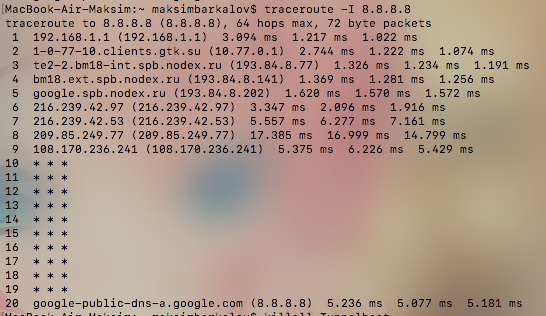
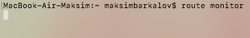

Министерство образования и науки российской федерации\
федеральное государственное автономное образовательное учреждение
высшего образования

«Санкт-Петербургский национальный исследовательский университет
информационных технологий, механики и оптики»

Факультет информационных технологий и программирования

Кафедра информационных систем

Лабораторная работа №1

Изучение функциональных возможностей сетевых утилит командной строки

Выполнил студент группы №M3205\
Баркалов Максим Максимович

Проверил:\
Аксенов Владимир Олегович

***Цель работы: формирование представлений о функциональных возможностях
основных сетевых утилит, доступных через командную строку в ОС Windows
или через терминал в ОС Linux и Mac.\
***

***Произведем выполнение команд без аргументов.***

***\
***{width="5.311309055118111in"
height="3.722772309711286in"}

Рис. 1.1 - «*arp вывод без* *параметра*»

{width="5.375027340332458in"
height="3.7674321959755033in"}

Рис. 2.1 - «*ifconfig вывод без* *параметра*»

{width="5.706832895888014in"
height="4.0in"}

Рис. 3.1 - «*netstat* *вывод без* *параметра*»

{width="5.305719597550306in"
height="3.718853893263342in"}

Рис. 4.1 - «*ping вывод без* *параметра*»

{width="4.916666666666667in"
height="0.5277777777777778in"}

Рис. 5.1 - «*route* *вывод без* *параметра*»

{width="6.988888888888889in"
height="1.2729166666666667in"}

Рис. 6.1 - «*traceroute* *вывод без* *параметра*»

Для команд выше в macOS команды справки нет.

***Произведем разделение параметров сетевых утилит на две группы:
параметры настройки и параметры отображения***

Таблица 1.1.1 -- Параметры сетевой утилиты arp

  **Группа параметров**                                                                                                       
  ------------------------------------- --------------------------------------- ------------------- ------- ----------------- --------------------------------
  **1 группа -- параметры настройки**   **2 группа -- параметры отображения**                                                 
  **№**                                 **Обозначение**                         **Назначение**      **№**   **Обозначение**   **Назначение**
  1                                     -d                                      Удаление записи     1       -a                Отображение таблицы
  2                                     -s                                      Добавление записи   2       -n \<addr\>       Отображение конкретного адреса

Таблица 1.1.2 -- Значения параметров 1 группы сетевой утилиты arp

  **№**   **Обозначение параметра**   **Значение параметра**
  ------- --------------------------- -------------------------------
  1       -d                          Адрес 0.0.0.0-255.255.255.255
  2       -s                          Адрес 0.0.0.0-255.255.255.255

Таблица 2.1.1 -- Параметры сетевой утилиты ifconfig

  **Группа параметров**                                                                                                                             
  ------------------------------------- --------------------------------------- ---------------------------------------- ------- ------------------ ------------------------------------------
  **1 группа -- параметры настройки**   **2 группа -- параметры отображения**                                                                       
  **№**                                 **Обозначение**                         **Назначение**                           **№**   **Обозначение**    **Назначение**
  1                                     \<interface\> up                        Включение интерфейса                     1       \<interface\>      Вывод конкретного интерфейса
  2                                     \<interface\> down                      Выключение интерфейса                    2       -v \<interface\>   Вывод подробной информации по интерфейсу
  3                                     \<interface\> arp                       Включение поддержки arp                                             
  4                                     \<interface\> -arp                      Выключение поддержки arp                                            
  5                                     \<interface\> netmask \<addr\>          Установка маски сети                                                
  6                                     \<interface\> \<addr\>                  Добавление ip адреса                                                
  7                                     \<interface\> broadcast \<addr\>        Установка широковещательного адреса                                 
  8                                     \<interface\> mtu \<number\>            Установка максимального размера пакета                              

Таблица 2.1.2 -- Значения параметров 1 группы сетевой утилиты ifconfig

  **№**   **Обозначение параметра**          **Значение параметра**
  ------- ---------------------------------- ----------------------------------------------------
  1       \<interface\> up                   Название интерфейса
  2       \<interface\> down                 Название интерфейса
  3       \<interface\> arp                  Название интерфейса
  4       \<interface\> -arp                 Название интерфейса
  5       \<interface\> netmask \<addr\>     Название интерфейса, адрес 0.0.0.0-255.255.255.255
  6       \<interface\> \<addr\>             Название интерфейса, адрес 0.0.0.0-255.255.255.255
  7       \<interface\> broadcast \<addr\>   Название интерфейса, адрес 0.0.0.0-255.255.255.255
  8       \<interface\> mtu \<number\>       Название интерфейса, число размера пакета 46-16110

Таблица 3.1.1 -- Параметры сетевой утилиты netstat

  **Группа параметров**                                                                                                    
  ------------------------------------- --------------------------------------- ---------------- ------- ----------------- -----------------------------------------------------------
  **1 группа -- параметры настройки**   **2 группа -- параметры отображения**                                              
  **№**                                 **Обозначение**                         **Назначение**   **№**   **Обозначение**   **Назначение**
                                                                                                 1       -n                Отображать сетевые адреса как числа
                                                                                                 2       -m                Отображение статистических данных об использовании памяти
                                                                                                 3       -r                Вывод таблицы маршрутов
                                                                                                 4       -s                Статистика по протоколам

Таблица 4.1.1 -- Параметры сетевой утилиты ping

  **Группа параметров**                                                                                                                
  ------------------------------------- --------------------------------------- ---------------------------- ------- ----------------- ---------------------------------------------------
  **1 группа -- параметры настройки**   **2 группа -- параметры отображения**                                                          
  **№**                                 **Обозначение**                         **Назначение**               **№**   **Обозначение**   **Назначение**
  1                                     -с \<num\>                              Установка числа пакетов      1       -q                Тихий режим --- вывод только финальной статистики
  2                                     -s\<num\>                               Установка размера пакета                               
  3                                     -W\<num\>                               Установка времени ожидания                             
  4                                     -M do                                   Запрет фрагментации                                    
  5                                     -m \<num\>                              Изменение TTL                                          

Таблица 4.1.2 -- Значения параметров 1 группы сетевой утилиты ping

  **№**   **Обозначение параметра**   **Значение параметра**
  ------- --------------------------- ------------------------
  1       -c                          Число 1..inf
  2       -s                          Число 0..65507
  3       -W                          Число 0..2147483647
  4       -m                          Число 0..255

Таблица 5.1.1 -- Параметры сетевой утилиты route

  **Группа параметров**                                                                                                                 
  ------------------------------------- --------------------------------------- ----------------------------- ------- ----------------- ---------------------------------------
  **1 группа -- параметры настройки**   **2 группа -- параметры отображения**                                                           
  **№**                                 **Обозначение**                         **Назначение**                **№**   **Обозначение**   **Назначение**
  1                                     add                                     Добавить маршрут              1       monitor           Выводить изменения в маршрутах
  2                                     flush                                   Удалить все маршруты          2       get               Показать маршрут до адреса назначения
  3                                     delete                                  Удалить конкретный маршрут                              
  4                                     change                                  Изменить параметры маршрута                             

Таблица 5.1.2 -- Значения параметров 1 группы сетевой утилиты route

  **№**   **Обозначение параметра**   **Значение параметра**
  ------- --------------------------- ------------------------
  1       add                         Маршрут
  2       delete                      Маршрут
  3       change                      Маршрут

***Пример:***

***\
***{width="6.988888888888889in"
height="2.810416666666667in"}***\
***

Таблица 6.1.1 -- Параметры сетевой утилиты traceroute

  **Группа параметров**                                                                                                                                
  ------------------------------------- --------------------------------------- -------------------------------------------- ------- ----------------- ------------------------------------
  **1 группа -- параметры настройки**   **2 группа -- параметры отображения**                                                                          
  **№**                                 **Обозначение**                         **Назначение**                               **№**   **Обозначение**   **Назначение**
  1                                     -w                                      Установить время ожидания                    1       -n                Отключение отображения URL адресов
  2                                     -m                                      Установить максимальное количество прыжков   2                         
  3                                     -q                                      Установить количество пакетов                                          
  4                                     -I                                      Использовать ICMP                                                      

Таблица 6.1.2 -- Значения параметров 1 группы сетевой утилиты traceroute

  **№**   **Обозначение параметра**   **Значение параметра**
  ------- --------------------------- -------------------------
  1       -w                          Число 1..86400
  2       -m                          Число 1..255
  3       -q                          Число 1..99999999999999

***\
Произведем запуск команд со всеми парамаетрами группы 1***

1.  ***Утилита arp***

{width="6.988888888888889in"
height="1.2583333333333333in"}

Рис. 1.3.*1*- «*arp 1 группа* *вывод с* *параметром -d*»

{width="6.988888888888889in"
height="0.6965277777777777in"}

Рис. 1.3.*2*- «*arp 1 группа* *вывод с* *параметром -s*»

2.  ***Утилита ifconfig\
    ***{width="6.555261373578302in"
    height="0.28888888888888886in"}

Рис. 2.3.*1*- «*ifconfig 1 группа* *вывод с* *параметром enp0s3 -arp*»

{width="6.688004155730534in"
height="0.23125in"}

Рис. 2.3.*2*- «*ifconfig 1 группа* *вывод с* *параметром enp0s3 arp*»

{width="6.758567366579178in"
height="0.24443678915135608in"}

Рис. 2.3.*3*- «*ifconfig 1 группа* *вывод с* *параметром enp0s3 up*»

{width="6.688004155730534in"
height="0.25069444444444444in"}

Рис. 2.3.*4*- «*ifconfig 1 группа* *вывод с* *параметром enp0s3 down*»

{width="6.44906605424322in"
height="0.225in"}

Рис. 2.3.*5*- «*ifconfig 1 группа* *вывод с* *параметром enp0s3 netmask
255.255.255.0*»

{width="6.749950787401575in"
height="0.2263888888888889in"}

Рис. 2.3.*6*- «*ifconfig 1 группа* *вывод с* *параметром enp0s3
broadcast 10.0.2.255*»

{width="6.670305118110236in"
height="0.25763888888888886in"}

Рис. 2.3.*7*- «*ifconfig 1 группа* *вывод с* *параметром enp0s3 mtu
1280*»

{width="6.466765091863517in"
height="0.29791666666666666in"}

Рис. 2.3.*8*- «*ifconfig 1 группа* *вывод с* *параметром enp0s3
8.8.8.8*»\
\
3. Утилита netstat -\
4. Утилита Ping\
{width="6.166666666666667in"
height="1.6527777777777777in"}

Рис. 4.3.*1*- «*ping 1 группа* *вывод с* *параметром -c2 8.8.8.8*»

{width="5.75in"
height="1.2638888888888888in"}

Рис. 4.3.*2*- «*ping 1 группа* *вывод с* *параметром -s10 8.8.8.8*»

{width="5.722222222222222in"
height="0.6388888888888888in"}

Рис. 4.3.*3*- «*ping 1 группа* *вывод с* *параметром -W2 8.8.8.8*»

{width="6.650074365704287in"
height="2.0277777777777777in"}

Рис. 4.3.*4*- «*ping 1 группа* *вывод с* *параметром -m3 8.8.8.8*»

{width="6.422517497812773in"
height="0.8283409886264217in"}

Рис. 4.3.*5*- «*ping 1 группа* *вывод с* *параметром -M 8.8.8.8*»\
5. Утилита route\
Пример работы\
{width="6.537562335958005in"
height="2.6289260717410325in"} Рис. 5.3.*1*- «*route 1 группа* *с
параметрами*»\
\
6. Утилита traceroute\
{width="5.959476159230096in"
height="4.2990660542432195in"}\
Рис. 6.3.*1*- «*traceroute 1 группа* *вывод с* *параметром -w2 8.8.8.8*»

{width="5.988888888888889in"
height="3.4597976815398077in"}

Рис. 6.3.*2*- «*traceroute 1 группа* *вывод с* *параметром -m10
8.8.8.8*»

{width="6.241225940507436in"
height="4.259834864391951in"}

Рис. 6.3.*3*- «*traceroute 1 группа* *вывод с* *параметром -q4 8.8.8.8*»

{width="6.26926290463692in"
height="3.6286220472440944in"}

Рис. 6.3.*4*- «*traceroute 1 группа* *вывод с* *параметром -I 8.8.8.8*»

***Произведем запуск команд со всеми параметрами группы 2***

1.  ***Утилита arp***

{width="6.902777777777778in"
height="1.2222222222222223in"}

Рис. 1.4.*1*- «*arp 2 группа* *вывод с* *параметром -a*»

{width="6.458333333333333in"
height="0.375in"}

Рис. 1.4.*2*- «*arp 2 группа* *вывод с* *параметром -n*»

2.  ***Утилита ifconfig\
    ***{width="6.457915573053368in"
    height="1.6625in"}

Рис. 2.4.*1*- «*ifconfig 2 группа* *вывод с* *параметром en0*»

{width="6.440216535433071in"
height="2.673611111111111in"}

Рис. 2.4.*2*- «*ifconfig 2 группа* *вывод с* *параметром -v en0*»

3.  ***Утилита netstat\
    ***{width="6.139331802274715in"
    height="3.5180369641294837in"}

Рис. 3.4.*1*- «*netstat 2 группа* *вывод с* *параметром -n*»

{width="4.997290026246719in"
height="2.8636089238845144in"}

Рис. 3.4.*2*- «*netstat 2 группа* *вывод с* *параметром -m*»

{width="5.572428915135608in"
height="3.1931835083114612in"}

Рис. 3.4.*1*- «*netstat 2 группа* *вывод с* *параметром -r*»

{width="3.9911504811898513in"
height="3.1250262467191603in"}

Рис. 3.4.*1*- «*netstat 2 группа* *вывод с* *параметром -s*»

4.  ***Утилита ping\
    ***{width="6.166666666666667in"
    height="1.25in"}***\
    ***Рис. 4.4.*1*- «*ping 2 группа* *вывод с* *параметром -q*»

5.  ***Утилита route\
    ***{width="5.979543963254593in"
    height="1.386155949256343in"}***\
    ***Рис. 5.4.*1*- «*route 2 группа* *вывод с* *параметром get
    8.8.8.8*»

{width="5.055555555555555in"
height="0.7777777777777778in"}

Рис. 5.4.*2*- «*route 2 группа* *вывод с* *параметром monitor*»

6.  ***Утилита traceroute\
    ***{width="5.101038932633421in"
    height="3.0619411636045495in"}

Рис. 6.4.*1*- «*traceroute 2 группа* *вывод с* *параметром -n*»

Запустим утилиты с несколькими параметрами

{width="6.727206911636046in"
height="0.31750984251968506in"}

Рис. 2.5.1 - «ifconfig *1 группа* *1 категория* *вывод с* *параметрами
up arp*»

{width="6.48421697287839in"
height="0.21970581802274716in"}

Рис. 2.5.2 - «ifconfig *1 группа* *1 категория* *вывод с* *параметрами
up netmask 255.255.255.0*»

{width="6.755244969378827in"
height="0.18727252843394576in"}

Рис. 2.5.3 - «ifconfig *1 группа* *1 категория* *вывод с* *параметрами
netmask 255.255.255.0 broadcast 10.0.3.255*»

{width="6.988888888888889in"
height="3.0166666666666666in"}

Рис. 3.6.1 - «netstat *2 группа* *1 категория* *вывод с* *параметрами -r
-n*»

{width="6.988888888888889in"
height="1.6861111111111111in"}

Рис. 3.6.2 - «netstat *2 группа* *1 категория* *вывод с* *параметрами -s
-r*»

{width="6.0in"
height="1.6388888888888888in"}

Рис. 4.5.1 - «ping *1 группа* *1 категория* *вывод с* *параметрами -c2
-m20 8.8.8.8*»

{width="6.166458880139983in"
height="0.8853871391076116in"}

Рис. 4.5.2 - «ping *1 группа* *1 категория* *вывод с* *параметрами -c3
-W2*»

{width="6.0in"
height="1.7638888888888888in"}

Рис. 4.5.3 - «ping *1 группа* *1 категория* *вывод с* *параметрами -c3
-s10 8.8.8.8*»\
{width="6.988888888888889in"
height="6.927083333333333in"}Рис. 6.5.1 - «traceroute *1 группа* *1
категория* *вывод с* *параметрами -w1 -q10 8.8.8.8*»

{width="6.301388888888889in"
height="1.0825820209973753in"}

Рис. 6.5.2 - «traceroute *1 группа* *1 категория* *вывод с* *параметрами
-m5 -q6 8.8.8.8*»

{width="6.988888888888889in"
height="1.7118055555555556in"}

Рис. 6.5.3 - «traceroute *1 группа* *1 категория* *вывод с* *параметрами
-m7 -I 8.8.8.8*»

Выводы

Сетевые утилиты предназначены для настройки, анализа или мониторинга
сетевого подключения. Позволяют изменять маршруты, широковещательный
адрес, адрес dns-сервера, маску подсети и др. Можно получить информацию
о маршруте пакета до конечного узла, о времени между отправкой пакета и
получением ответа.

\- запуск утилиты без параметров отображает краткую справку по
использованию утилиты

\- запуск утилиты с параметрами настройки позволяют настраивать сетевые
параметры

\- запуск утилиты с параметрами отображения позволяет отфильтровать
необходимую информацию: сделать некую выборку

Сетевые утилиты могут иметь как параметры для настройки сети, так и
параметры для отображения информации о сети. Они бывают сочетаемыми
(т.е. когда можно комбинировать два и более параметра) или несочетаемыми
(когда применение более одног параметра или применение некоторых двух
параметров вместе невозможно).
