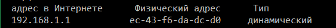
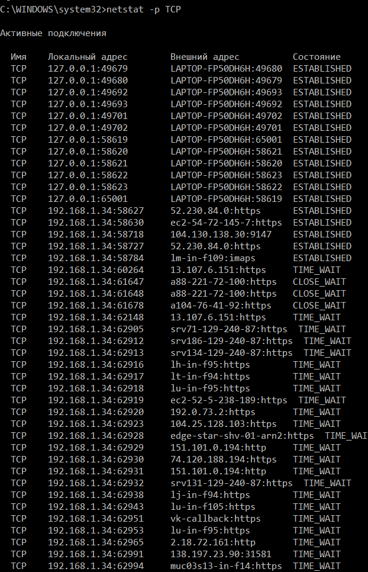

МИНИСТЕРСТВО ОБРАЗОВАНИЯ И НАУКИ РОССИЙСКОЙ ФЕДЕРАЦИИ\
ФЕДЕРАЛЬНОЕ ГОСУДАРСТВЕННОЕ АВТОНОМНОЕ ОБРАЗОВАТЕЛЬНОЕ УЧРЕЖДЕНИЕ
ВЫСШЕГО ОБРАЗОВАНИЯ

«Санкт-Петербургский национальный исследовательский университет

информационных технологий, механики и оптики»

Факультет информационных технологий и программирования

Кафедра информационных систем

Лабораторная работа № 2

Применение сетевых утилит для решения задач, возникающих в сетях связи

> Выполнил студент группы № M3205\
> Баркалов Максим Максимович
>
> Проверил:\
> Аксенов Владимир Олегович

Цель работы:

Получение навыков по решению задачи определения доступности сетевого
узла при различных вариантах его размещения

Получение навыков по решению задач управления параметрами сетевых узлов,
необходимых для организации связи

Получение навыков по решению задач управления сетевыми соединениями
между информационными приложениями, работающими на сетевых узлах

Получение навыков по решению задач маршрутизации в сетях связи

Воспользуемся утилитой ipconfig для просмотра сетевых параметров

{width="5.5in"
height="1.5415485564304463in"}

Рис. 1.1. «Сетевые параметры компьютера LAPTOP-FP50DH6H»

Просмотрим сетевые устройства в локальной сети при помощи утилиты arp

{width="3.7666666666666666in"
height="2.0018646106736657in"}

Рис. 1.2. «Сетевые устройства в локальной сети»

Воспользуемся утилитой ping для проверки доступности различных узлов в
локальной сети

{width="5.1in"
height="2.079173228346457in"}

Рис. 1.3. «Проверка доступности 192.168.1.33»

{width="4.189394138232721in"
height="1.7992497812773403in"}

Рис. 1.3. «Проверка доступности 192.168.1.36»

{width="4.469697069116361in"
height="1.881609798775153in"}

Рис. 1.3. «Проверка доступности 192.168.1.1»\
\
Сведем полученные данные о локальной сети в таблицу

Таблица 1 -- Сетевые параметры

  Устройство   \[Роутер\] 192.168.1.1                          
  ------------ -------------------------- -------------------- ------------------------------------
  №            Сетевой параметр           Значение             Назначение
  1            Адрес в интернете           192.168.1.1          Адрес устройства в локальной сети
  2            Физический адрес            ec-43-f6-da-dc-d0    Mac-адрес устройства
  3            Тип                        динамический         Может меняться
  Устройство   \[Ноутбук\] 192.168.1.33                        
  №            Сетевой параметр           Значение             Назначение
  1            Адрес в интернете           192.168.1.33         Адрес устройства в локальной сети
  2            Физический адрес            f0-79-60-1a-74-c4    Mac-адрес устройства
  3            Тип                        динамический         Может меняться
  Устройство   \[Телефон\] 192.168.1.36                        
  №            Сетевой параметр           Значение             Назначение
  1            Адрес в интернете           192.168.1.36         Адрес устройства в локальной сети
  2            Физический адрес            34-ce-00-80-f8-a9    Mac-адрес устройства
  3            Тип                        динамический         Может меняться

Сведем среднее время приема-передачи пакетов в единую таблицу

Таблица 1.1 -- Доступность узла

  №   Сетевой адрес устройства   Доменное имя устройства   Среднее время приема-передачи, мс
  --- -------------------------- ------------------------- -----------------------------------
  1    192.168.1.1               \-                        2
  2    192.168.1.33              \-                        42
  3    192.168.1.36              \-                        127

Наблюдаем самое малое время при обращении к маршрутизатору

Воспользуемся утилитой ipconfig с ключом /all для вывода подробных
сетевых параметров

{width="5.941666666666666in"
height="2.7428707349081365in"}

Рис 2.1. «Сетевые параметры компьютера LAPTOP-FP50DH6H»

Воспользуемся утилитой arp для просмотра параметров одного из узлов в
локальной сети

{width="5.575in"
height="0.4654090113735783in"}

Рис 2.2. «Сетевые параметры компьютера 192.168.1.1»

Выведем таблицу маршрутизации при помощь утилиты route, команды print\
{width="6.6in"
height="2.8830643044619424in"}

Рис 2.3. «Маршрутизация на устройстве LAPTOP-FP50DH6H»

Проверим доступность шлюза и DNS-сервера запросив ip-адрес для домена с
помощью утилиты nslookup

{width="6.197916666666667in"
height="1.875in"}

Рис 2.4. «Проверка доступности шлюза 192.168.1.1 DNS-сервера
192.168.1.1»

Проверим доступность узла во внешней сети с помощью утилиты ping

{width="5.058333333333334in"
height="2.398274278215223in"}

Рис 2.5. «Проверка доступности 193.84.8.202»

Просмотрим путь до узла с помощью утилиты tracert

{width="4.408333333333333in"
height="3.547379702537183in"}

Рис 2.6. «Сетевые устройства между LAPTOP-FP50DH6H 8.8.8.8»

Сведем среднее время приема-передачи и доменные имена внешних узлов в
единую таблицу

Таблица 1.2 -- Доступность узла

  №   Сетевой адрес устройства   Доменное имя устройства          Среднее время приема-передачи, мс
  --- -------------------------- -------------------------------- -----------------------------------
  1    193.84.8.202              google.spb.nodex.ru              3
  2    8.8.8.8                   Google-public-dns-a.google.com   7

Не трудно заметить, что время доступа до узла, который находится ближе,
меньше, чем до узла, который находится дальше\
\
С помощью утилиты netstat просмотрим соединения по loopback

{width="7.208333333333333in"
height="3.625in"}

Рис 3.1 «Netstat соединения по loopback»

С помощью утилиты netstat просмотрим подключения по протоколу TCP

{width="3.5in"
height="4.908735783027121in"}

Рис 3.2 «Netstat соединения по TCP»

С помощью утилиты netstat просмотрим подключения по протоколу UDP

{width="4.780302930883639in"
height="1.8183617672790902in"}

Рис 3.3 «Netstat соединения по UDP»

Сопоставим значения из утилиты netstat с данными, которые они обозначают

Таблица 2 --- значения данных утилита netstat

  №   Название параметра        Значение параметра   
  --- ------------------------- -------------------- ----------------
                                TCP-соединение       UDP-соединение
  1   Сетевой адрес локальный    2 столбец до :      \-
  2   Порт локальный             2 столбец после :   \-
  3   Сетевой адрес внешний      3 столбец до :      \-
  4   Порт внешний               3 столбец после :   \-
  5   Состояние                  4 столбец           \-

Просмотрим с помощью утилиты netstat подключения по TCP при
использовании Chrome

{width="6.185475721784777in"
height="9.606382327209099in"}

Рис. 4.1.1 «Chrome соединения по TCP»

Просмотрим с помощью утилиты netstat подключения по TCP при
использовании Edge

{width="6.302083333333333in"
height="7.90625in"}

Рис. 4.1.1 «Edge соединения по TCP»

Просмотрим с помощью утилиты netstat подключения по UDP при
использовании Chrome

{width="6.677083333333333in"
height="1.1041666666666667in"}

Рис.4.2.1 «Chrome соединения по UDP»

Просмотрим с помощью утилиты netstat подключения по UDP при
использовании Edge

{width="6.677083333333333in"
height="1.1041666666666667in"}

Рис.4.2.2 «Edge соединения по UDP»

Просмотрим с помощью утилиты netstat подключения по TCP при открытии
двух копий страниц в Chrome. На скриншоте видно два подключения.
Использована страница личного сайта fizmatspb.ru, а также режим
инкогнито браузера для уменьшения попадания дополнительных подключений в
выборку (из-за рекламы, систем отслеживаний и др.)

{width="6.988194444444445in"
height="1.08125in"}\
Рис.4.3.1 «Chrome соединения по TCP две копии»

Просмотрим с помощью утилиты netstat подключения по UDP при открытии
двух копий страниц в Chrome

{width="6.677083333333333in"
height="1.1041666666666667in"}

Рис.4.4.1 «Chrome соединения по UDP две копии»

Просмотрим с помощью утилиты netstat подключения по TCP при открытии
нескольких сайтов в Chrome

{width="6.988194444444445in"
height="3.7020833333333334in"}

Рис.4.5.1 «Chrome соединения по TCP несколько сайтов»

Просмотрим с помощью утилиты netstat подключения по UDP при открытии
нескольких страниц в Chrome

{width="6.90625in" height="1.34375in"}

Рис.4.6.1 «Chrome соединения по UDP несколько сайтов»

6 Выводы

Сделать выводы по каждой использованной в работе сетевой утилите

Ipconfig

-от чего зависит тип интерфейса

От сетевой карты

-какие параметры являются обязательными для всех типов

DNS-суффикс подключения, состояние среды, описание, физический адрес,
Автонастройка включена, DHCP включен.

-как можно понять имеет ли данный интерфейс выход в глобальную сеть

По наличию маршрутизатора

Arp

-какой протокол используется сетевой утилитой

ARP

-как добавить в таблицу статический адрес, динамический адрес

arp -s 157.55.85.212 00-aa-00-62-c6-09 .. Добавляет статическую запись.

Динамические создаются только модулем arp

-какой адрес всегда будет в таблице для любого сетевого интерфейса

192.168.1.255

Ping

-какой протокол используется сетевой утилитой

ICMP

-какие особенности работы в беспроводных сетях / проводных сетях

Разный предельно допустимый размер пакета 1480/65535

-как можно использовать утилиту ping для определения сетевых устройств
на маршруте от своего сетевого устройства к устройству в глобальной сети

{width="4.416666666666667in"
height="1.9581988188976378in"}

Netstat

-как определить количество открываемых приложением соединений с сервером

Netstat -b

-какие порты используются для выхода в глобальную сеть

80,443

-для чего предназначены адреса 0.0.0.0

Адрес 0.0.0.0 называется шлюзом по умолчанию, для него невозможно
определить маршрут по таблице маршрутизации сетевого устройства, за ним
по сути может скрываться любой IP адрес. Если передать пакет по другим
маршрутам невозможно, его отправляют на этот адрес.

Route

-сколько может быть маршрутов по умолчанию

1

-как добавить в таблицу маршрут в другую сеть, маршрут к другому узлу

С помощью команды route ADD, указав сетевой адрес, маску и узел

-какой еще утилитой можно посмотреть таблицу маршрутизации

Netstat -r
