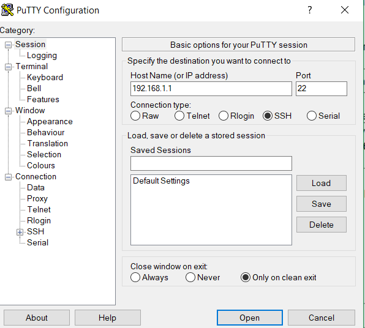
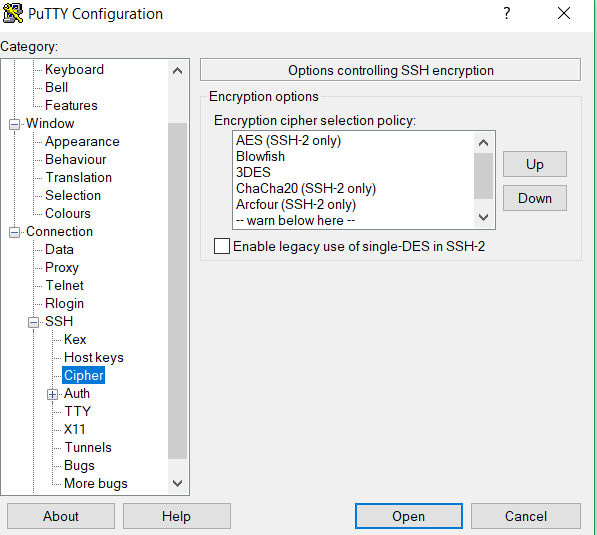

МИНИСТЕРСТВО ОБРАЗОВАНИЯ И НАУКИ РОССИЙСКОЙ ФЕДЕРАЦИИ\
ФЕДЕРАЛЬНОЕ ГОСУДАРСТВЕННОЕ АВТОНОМНОЕ ОБРАЗОВАТЕЛЬНОЕ УЧРЕЖДЕНИЕ
ВЫСШЕГО ОБРАЗОВАНИЯ

«Санкт-Петербургский национальный исследовательский университет

информационных технологий, механики и оптики»

Факультет информационных технологий и программирования

Кафедра информационных систем

Лабораторная работа № 3

Изучение принципов удаленного управления устройствами сетей связи

> Выполнил студент группы №M3205\
> Баркалов Максим Максимович
>
> Проверил:
>
> Аксенов Владимир Олегович

САНКТ--ПЕТЕРБУРГ

2018

Цель работы:

Организация безопасных и небезопасных сетевых соединений для удаленного
управления устройствами сетей связи\
\
Запустим программу Putty

{width="3.722658573928259in"
height="3.308333333333333in"}

Рис. 1. сетевые параметры для организации сеанса управления по протоколу
Telnet\
\
Произведем настройку согласно условию задания

{width="2.9524529746281716in"
height="2.6458333333333335in"}

Рис.2. дополнительные параметры соединения по протоколу Telnet

Настроим запись сеанса в журнал событий

{width="3.902678258967629in"
height="3.525in"}

Рис.3. Настройки записи сеанса управления по протоколу Telnet в журнал
событий\
\
Проверим подключение при помощи утилиты Netstat

{width="7.802083333333333in"
height="0.40625in"}

Рис.4 Таблица сетевых соединений протокол Telnet

Заполним таблицу информации о подключении

  №   Название устройства   Сетевой адрес устройства   Название протокола   Номер порта   Роль агента, реализующего протокол
  --- --------------------- -------------------------- -------------------- ------------- ------------------------------------
  1   ПК                    192.168.1.34               telnet               netstat       клиент
  2   Роутер                192.168.1.1                telnet               23            сервер

Настроим утилиту Putty для работы по протоколу SSH

{width="2.9188429571303587in"
height="2.625in"}

Рис.5. сетевые параметры для организации сеанса управления по протоколу
SSH

Настроим запись сеанса в журнал событий

{width="3.775in"
height="3.3646741032370953in"}

Рис.6. Настройки записи сеанса управления по протоколу SSH в журнал
событий

Произведем настройку согласно условию задания

{width="4.358333333333333in"
height="3.9446609798775154in"}

{width="3.762919947506562in"
height="3.4583333333333335in"}

{width="3.7666666666666666in"
height="3.375488845144357in"}

Рис.7,8,9. дополнительные параметры соединения по протоколу SSH

Проверим подключение при помощи утилиты Netstat

{width="6.385416666666667in"
height="0.4166666666666667in"}

Рис.10. Таблица сетевых соединений протокол SSH

Заполним таблицу информации о подключении

  №   Название устройства   Сетевой адрес устройства   Название протокола   Номер порта   Роль агента, реализующего протокол
  --- --------------------- -------------------------- -------------------- ------------- ------------------------------------
  1   ПК                     192.168.1.84              ssh                  netstat       клиент
  2   Роутер                 192.168.1.1               ssh                  22            сервер

Просмотрим лог-файл подключения по протоколу Telnet

{width="7.873611111111111in"
height="1.8194444444444444in"}

Рис. 11 Информация файла журнала событий Telnet\_Session\_Logging.log

Просмотрим лог-файл подключения по протоколу SSH

{width="7.873611111111111in"
height="1.7965277777777777in"}

Рис. 12 Информация файла журнала событий SSH\_Session\_Logging.log

6 Выводы

Особенности организации удаленного управления устройствами сетей связи

\- организация удаленного управления предусматривает выполнение
следующих шагов (необходимо перечислить последовательность шагов)

1.  Проверка настроек брандмауэра

2.  Проверка настроек сервера --- разрешение доступа по SSH

3.  Открыть порт для внешнего подключения

\- зачем необходимо выполнять записи в журнал событий

Для отслеживания и исправления ошибок

Удаленное управление через небезопасные сетевые соединения

\- какой протокол используется для организации небезопасных сетевых
соединений

telnet

\- отсутствие каких параметров не позволяет протоколу обеспечить
безопасноcть

-   Шифрование

-   Проверка подлинности данных

Удаленное управление через безопасные сетевые соединения

\- какой протокол используется для организации безопасных сетевых
соединений

SSH

\- наличие каких параметров позволяет протоколу обеспечить безопасность

-   Шифрование

-   Запрет на удалённый root-доступ

-   Запрет подключения с пустым паролем или отключения входа по паролю

-   Ограничение списка IP-адресов, с которых разрешён доступ

-   Проверка подлинности данных
