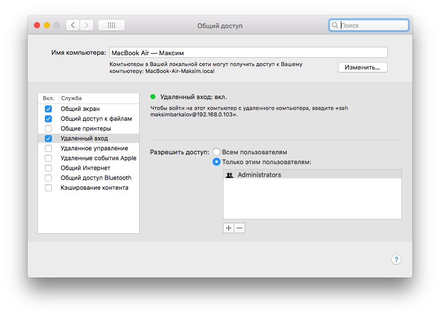
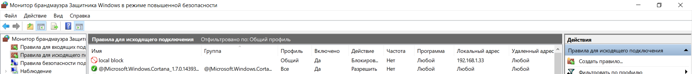

МИНИСТЕРСТВО ОБРАЗОВАНИЯ И НАУКИ РОССИЙСКОЙ ФЕДЕРАЦИИ\
ФЕДЕРАЛЬНОЕ ГОСУДАРСТВЕННОЕ АВТОНОМНОЕ ОБРАЗОВАТЕЛЬНОЕ УЧРЕЖДЕНИЕ
ВЫСШЕГО ОБРАЗОВАНИЯ

«Санкт-Петербургский национальный исследовательский университет

информационных технологий, механики и оптики»

Факультет информационных технологий и программирования

Кафедра информационных систем

Лабораторная работа № 4

Исследование основных способов обеспечения безопасности в сетях связи

> Выполнил студент группы №M3205\
> Баркалов Максим Максимович
>
> Проверил:
>
> Аксенов Владимир Олегович

САНКТ--ПЕТЕРБУРГ

2018

Цель работы: Формирование навыков по использованию основных инструментов
фильтрации трафика в сетях связи -- брандмауэров и iptables.\
Запустим брандмауэр:

{width="5.2in"
height="2.4692891513560804in"}

Рис.1.Включение Брандмауэра

Просмотрим профили брандмуэра:

{width="3.9067650918635173in"
height="2.9071587926509186in"}

Рис.2.Профили Брандмауэра Windows

Зайдем в настройки активного профиля:

{width="2.9579604111986in"
height="3.8333333333333335in"}

Рис.3.Настройка активного профиля

Просмотрим активные правила входящих подключений:

{width="7.873611111111111in"
height="4.186805555555556in"}

Рис.4.Активные правила входящих подключений

Добавим правило для блокировки Telegram Desktop

{width="7.683333333333334in"
height="1.2204691601049868in"}

Рис.5.Входящее подключение. Блокировка программы Telegram Desktop

Проверим работоспособность Telegram. Ожидается неработоспособность.

{width="7.597222222222222in"
height="2.4859492563429573in"}

Рис.6. «Входящее подключение. блокировка приложения Telegram Desktop.
Проверка1»

{width="7.697916666666667in"
height="0.4479166666666667in"}

Рис.7. «Входящее подключение. Блокировка приложения Telegram Desktop.
Проверка2»

Блокировкой входящих подключений нарушить работоспособность Telegram не
удалось.

Заблокируем порт 22. Ожидаем невозможность подключения к компьютеру по
протоколу SSH

{width="7.071630577427822in"
height="5.097586395450569in"}

Рис.8.Входящее подключение. Блокировка порта 22.

{width="7.873611111111111in"
height="4.929861111111111in"}

Рис.9.Входящее подключение. Блокировка порта 22. Проверка\
При отключении блокировки удаленный вход работает:

{width="6.0434689413823275in"
height="4.356435914260717in"}\
Рис. 8а. Порт 22 разблокирован.

{width="5.6161854768153985in"
height="3.5476377952755906in"}

Рис. 9а. Подключение производится

Заблокируем сетевой адрес 192.168.1.167. Ожидаем невозможность
подключения с этого адреса.

{width="7.873611111111111in"
height="1.0215277777777778in"}

Рис.10.Входящее подключение. Блокировка сетевого адреса 192.168.1.167

{width="5.736111111111111in"
height="0.5138888888888888in"}

Рис.11.Входящее подключение. Блокировка сетевого адреса 192.168.1.167.
Проверка\
Как видно из рисунка, подключения не происходит.\
При этом без блокировки подключение работает\
{width="7.873611111111111in"
height="5.747222222222222in"}

Рис.11а. Рабочее подключение

Просмотрим активные правила исходящих подключений

{width="7.873611111111111in"
height="1.648611111111111in"}

Рис.12.Активные правила исходящих подключений

Создадим правило для блокировки приложения Putty. Ожидаем
неработоспособность данного приложения.

{width="7.873611111111111in"
height="1.1722222222222223in"}

Рис.13.Исходящее подключение. Блокировка приложения Putty

{width="4.446969597550306in"
height="2.33173665791776in"}

Рис.14.Исходящее подключение. Блокировка приложения Putty. Проверка 1

Как видно из скриншота, приложение не работает.

Просмотрим активные подключения. Не обнаружеваем здесь порты,
используемые Putty.\
{width="4.74109908136483in"
height="4.712246281714785in"}

Рис.15.Исходящее подключение. Блокировка приложения Putty. Проверка 2

Блокируем исходящие подключение на порты 80 и 443, ожидаем блокировку
работы веб-сайтов при просмотре через браузер.

{width="7.873611111111111in"
height="0.95625in"}

Рис.16.Исходящее подключение. Блокировка портов 80,443

{width="5.465277777777778in"
height="2.7427613735783027in"}

Рис.17.Исходящее подключение. Блокировка портов 80,443. Проверка 1\
Как видно из скриншота, открываем браузер --- невозможно открыть
веб-страницу

{width="7.34375in"
height="0.6979166666666666in"}\
Рис.18.Исходящее подключение. Блокировка портов 80,443. Проверка 2

Как видно из скриншота, открываем Netstat --- соединения https закрыты.

Производим блокировку исходящего подключения на адрес 192.168.1.33.
Ожидаем невозможность подключения к данному узлу.

{width="7.873611111111111in"
height="0.8486111111111111in"}

Рис.19.Исходящее подключение. Блокировка сетевого адреса 192.168.1.33\
Проверяем доступность узла с помощью Ping. Узел не доступен.

{width="5.78125in" height="2.5in"}

Рис.20.Исходящее подключение. Блокировка сетевого адреса 192.168.1.33.
Проверка

6 Выводы

Особенности обеспечения безопасности в сетях связи

\- в чем заключается процедура обеспечения безопасности (что такое
фильтрация трафика)

Фильтрация трафика --- ограничение поступающего и исходящего трафика по
неким параметрам (порты, сетевые адреса)

\- какие инструменты обеспечения безопасности применяются

-   Брандмауэр/iptables

-   Антивирус

-   Антишпионское ПО

Структура и функции инструментов

\- какую структуру имеют инструменты обеспечения безопасности\
При поступлении пакета на сетевую карту сначала происходит фильтрация на
сетевом уровне (по протоколам ICMP, IPv4/6 и др), далее на транспортном
уровне (TCP, UDP и др), и, наконец, на уровне приложений (IMAP, HTTP,
SMTP и др).

В случае исходящего трафика, фильтрация происходит в обратном порядке.

\- какие функции выполняют инструменты обеспечения безопасности\
Фильтрация проходящего трафика.\
--- Пропуск пакета (allow)\
--- Отброс пакета (deny)\
--- Отброс с оповещением отправителя (reject) --- отправителю в данном
случае сообщается о недоступности сервера

Фильтрация осуществляется методом белого или черного списка.

Белый список --- запрещается всё, что явно не разрешено

Черный список --- разрешается всё, что явно не запрещено
