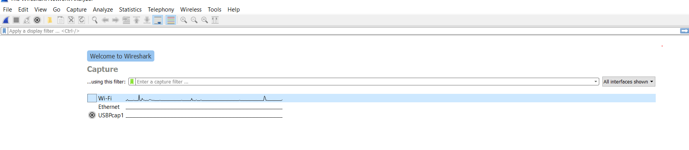
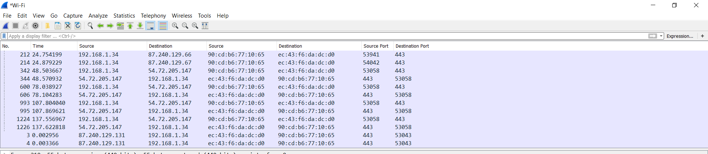
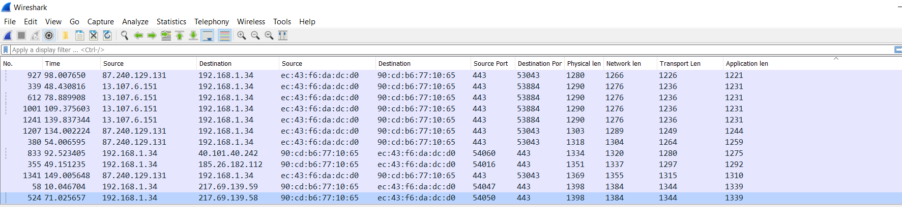
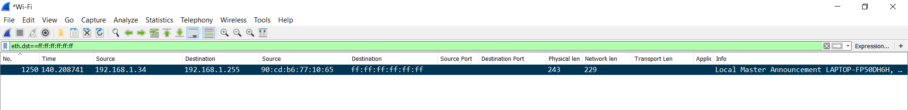
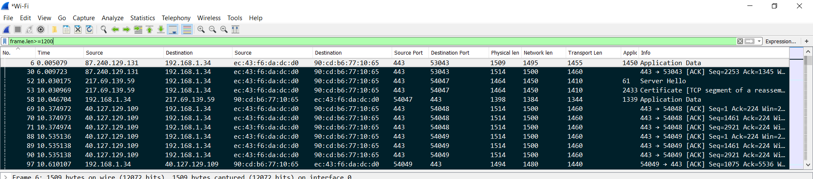
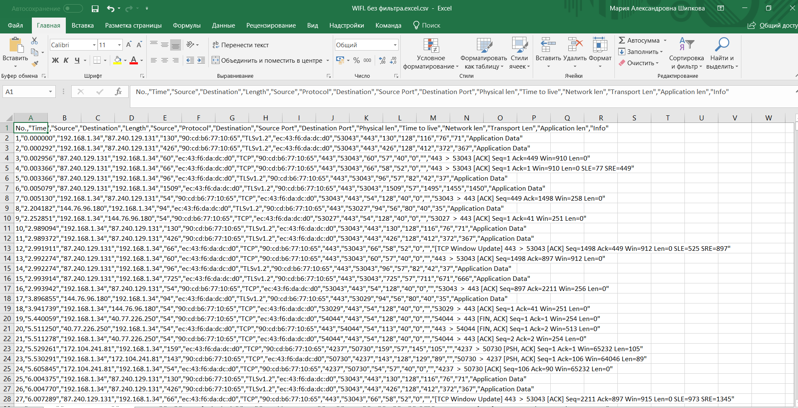
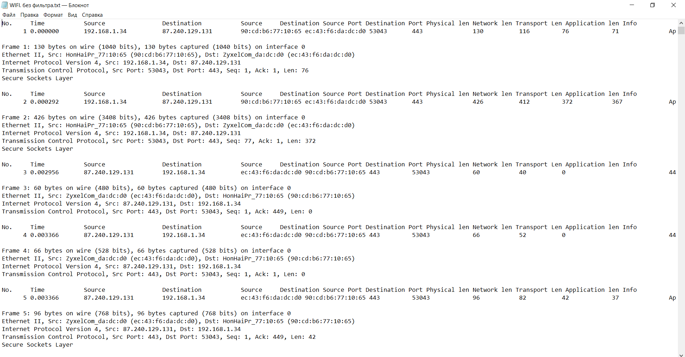

МИНИСТЕРСТВО ОБРАЗОВАНИЯ И НАУКИ РОССИЙСКОЙ ФЕДЕРАЦИИ\
ФЕДЕРАЛЬНОЕ ГОСУДАРСТВЕННОЕ АВТОНОМНОЕ ОБРАЗОВАТЕЛЬНОЕ УЧРЕЖДЕНИЕ
ВЫСШЕГО ОБРАЗОВАНИЯ

«Санкт-Петербургский национальный исследовательский университет

информационных технологий, механики и оптики»

Факультет информационных технологий и программирования

Кафедра информационных систем

Лабораторная работа № 5

Изучение функциональных возможностей программ для анализа сетевого
трафика

> Выполнил студент группы №M3205\
> Баркалов Максим Максимович
>
> Проверил:
>
> Аксенов Владимир Олегович

САНКТ--ПЕТЕРБУРГ

2018

Цель работы:

Формирование навыков по использованию основных программных инструментов
анализа сетевого трафика.

Откроем главное меню Wireshark

{width="7.873611111111111in"
height="1.7243055555555555in"}

Рис. 1- «Список доступных интерфейсов для захвата»

Настроим отображение согласно условию

{width="7.873611111111111in"
height="1.7222222222222223in"}

Рис. 2 - «Отображение по адресам»

Настроим отображение согласно условию

{width="7.873611111111111in"
height="1.8159722222222223in"}

Рис. 3 - «Отображение по длинам заголовка»

Выполним расчёт длин протоколов

Таблица 1 -- Длины протоколов

+---+--------------------------------------+----------+
| № | Параметр                             | Значение |
+===+======================================+==========+
| 1 | Длина протокола канального уровня    |  14      |
+---+--------------------------------------+----------+
| 2 | Длина протокола сетевого уровня      |  20      |
+---+--------------------------------------+----------+
| 3 | Длина протокола транспортного уровня | UDP 8    |
|   |                                      |          |
|   |                                      | TCP 20   |
+---+--------------------------------------+----------+

Рассмотрим фильтры отображения

Таблица 2 -- Фильтры отображения в wireshark

+----+-------------------------------+-------------------------------+
| №  | Название фильтра              | Фильтр в Wireshark            |
+====+===============================+===============================+
| 1  | Кадров Ethernet, отправляемых | eth.src==90:cd:b6:77:10:65    |
|    | с сетевого интерфейса         |                               |
+----+-------------------------------+-------------------------------+
| 2  | Кадров Ethernet, только       | eth.dst==90:cd:b6:77:10:65    |
|    | принимаемых на сетевой        |                               |
|    | интерфейс.                    |                               |
+----+-------------------------------+-------------------------------+
| 3  | Кадров Ethernet и             | eth.addr==90:cd:b6:77:10:65   |
|    | отправляемых, и принимаемых   |                               |
|    | сетевым интерфейсом.          |                               |
+----+-------------------------------+-------------------------------+
| 4  | Пакетов IP, только            | ip.src==192.168.1.34          |
|    | отправляемых с сетевого       |                               |
|    | интерфейса                    |                               |
+----+-------------------------------+-------------------------------+
| 5  | Пакетов IP, только            | ip.dst==192.168.1.34          |
|    | принимаемых на сетевой        |                               |
|    | интерфейс                     |                               |
+----+-------------------------------+-------------------------------+
| 6  | Пакетов IP и отправляемых, и  | ip.addr==192.168.1.34         |
|    | принимаемых сетевым           |                               |
|    | интерфейсом                   |                               |
+----+-------------------------------+-------------------------------+
| 7  | Сегментов TCP, только         | eth.src == 90:cd:b6:77:10:65  |
|    | отправляемых с сетевого       | &&                            |
|    | интерфейса -- на порты 80,    |                               |
|    | 443 (http, https)             | (tcp.dstport== 443 \|\|       |
|    |                               | tcp.dstport== 80)             |
+----+-------------------------------+-------------------------------+
| 8  | Сегментов TCP, только         | eth.dst == 90:cd:b6:77:10:65  |
|    | принимаемых на сетевой        | &&                            |
|    | интерфейс -- с портов 80, 443 |                               |
|    | (http, https)                 | (tcp.srcport== 443 \|\|       |
|    |                               | tcp.srcport== 80)             |
+----+-------------------------------+-------------------------------+
| 9  | Сегментов TCP и отправляемых, | tcp                           |
|    | и принимаемых сетевым         |                               |
|    | интерфейсом                   |                               |
+----+-------------------------------+-------------------------------+
| 10 | Датаграмм UDP, только         | eth.src == 90:cd:b6:77:10:65  |
|    | отправляемых с сетевого       | &&                            |
|    | интерфейса -- на порт 53      |                               |
|    | (dns)                         | udp.dstport== 53              |
+----+-------------------------------+-------------------------------+
| 11 | Датаграмм UDP, только         | eth.dst == 90:cd:b6:77:10:65  |
|    | принимаемых на сетевой        | &&                            |
|    | интерфейс -- с порта 53 (dns) |                               |
|    |                               | udp.srcport== 53              |
+----+-------------------------------+-------------------------------+
| 12 | Датаграмм UDP и отправляемых, | udp                           |
|    | и принимаемых сетевым         |                               |
|    | интерфейсом                   |                               |
+----+-------------------------------+-------------------------------+
| 13 | Сообщений протокола arp       | arp                           |
+----+-------------------------------+-------------------------------+
| 14 | Сообщений протокола icmp      | icmp                          |
+----+-------------------------------+-------------------------------+
| 15 | Сообщений протокола dns       | dns                           |
+----+-------------------------------+-------------------------------+
| 16 | Сообщений протокола http      | http                          |
+----+-------------------------------+-------------------------------+

Отобразим пакеты с MAC-адресом назначения ff:ff:ff:ff:ff:ff

{width="7.873611111111111in"
height="0.9638888888888889in"}

Рис. 4 - «Маркировка широковещательных кадров ethernet»\
Отобразим пакеты с длиной более 1203

{width="7.873611111111111in"
height="1.7472222222222222in"}

Рис. 5 - «маркировка пакетов по размеру»

Сравним вывод в excel и текстовый файл

{width="5.611694006999125in"
height="2.8766240157480314in"}

Рис. 6 - «Экспорт захвата в excel»

{width="6.797853237095363in"
height="3.5476181102362205in"}

Рис. 7 - «Экспорт захвата в txt»

Как видно из изображений, экспорт в excel отображает только данные из
верхней части окна программы Wireshark --- из таблицы, в которой
представлены пакеты. При экспорте в текстовый файл для каждого пакета
также выводится дополнительная информация по различным уровням TCP/IP
(от физического до уровня приложения) --- та информация, что выводится в
нижней части окна Wireshark, если выбрать конкретный пакет.

6 Выводы

Особенности процедуры анализа сетевого трафика

\- в чем заключается процедура

В написании фильтров для выборки нужных данных

\- какие данные используются для анализа

Пакеты данных

\- в каком виде представляются результаты анализа

В виде таблицы, где строки -- пакеты, а столбцы -- параметры этих
пакетов

Структура и функции программных инструментов анализа сетевого трафика

\- какую структуру имеют инструменты анализа сетевого трафика

Непосредственно модуль для перехвата трафика и инструменты для его
анализа

\- какие функции выполняют инструменты анализа сетевого трафика

1.  Захват трафика

2.  Декодирование сетевых протоколов всех уровней, включая уровень
    приложения.

3.  Фильтр трафика

\- для каждой функции привести название и описать в чем заключается

1.  Прослушивание и запись информации, проходящей через сетевую карту

2.  Анализ полученной информации, разбиение по стеку TCP/IP

3.  Вывод данных, соответствующих написанному пользователю фильтру
