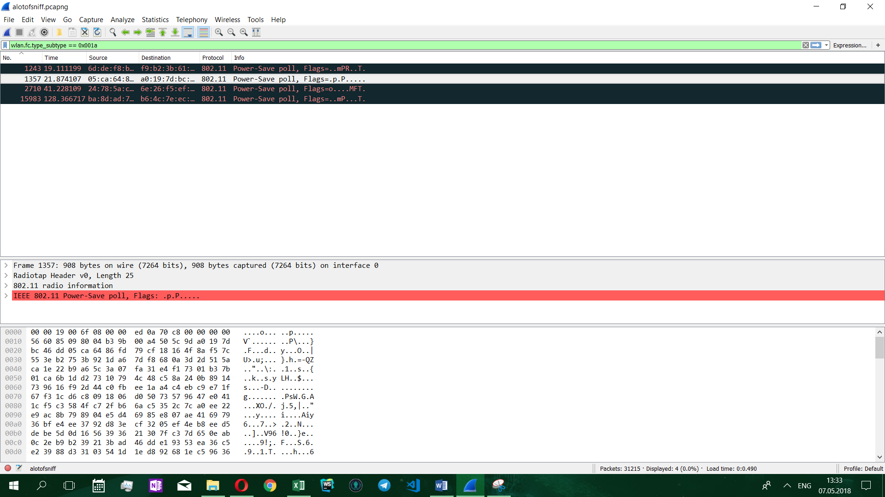
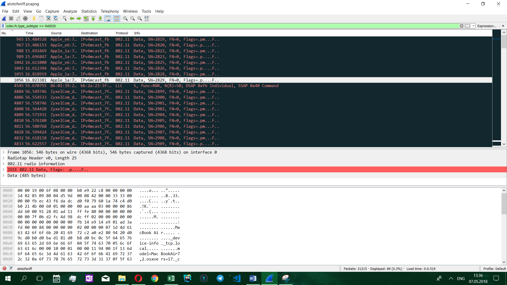
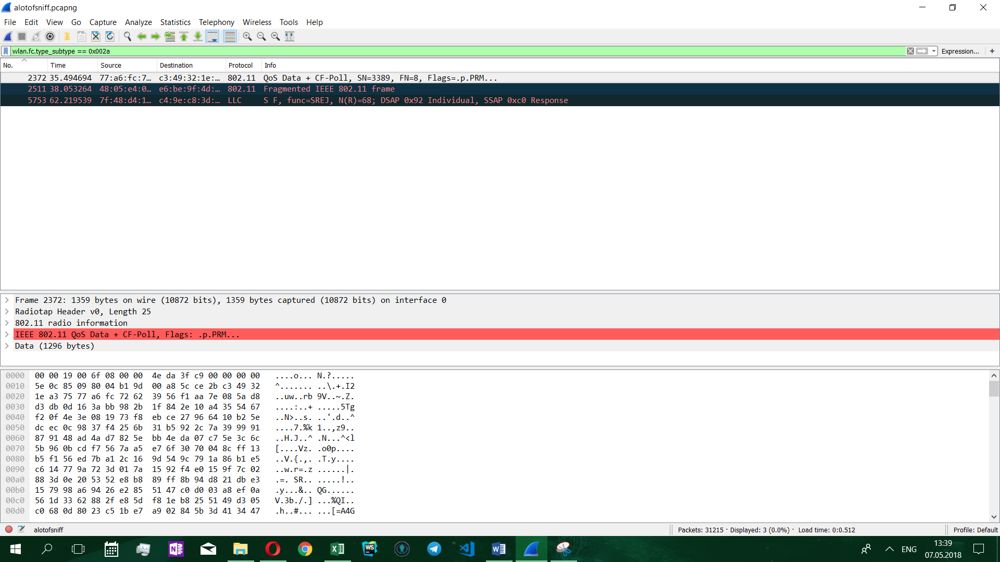
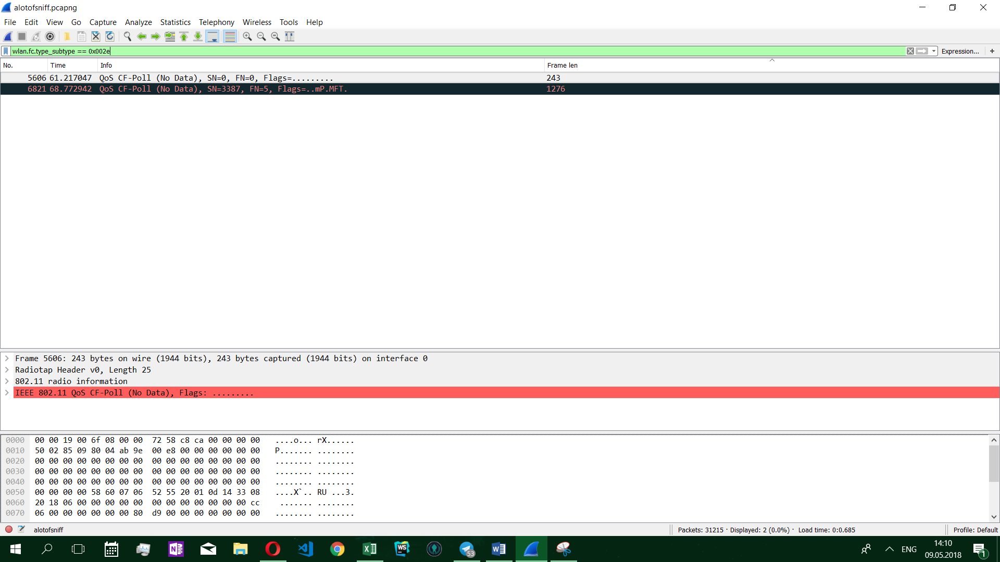
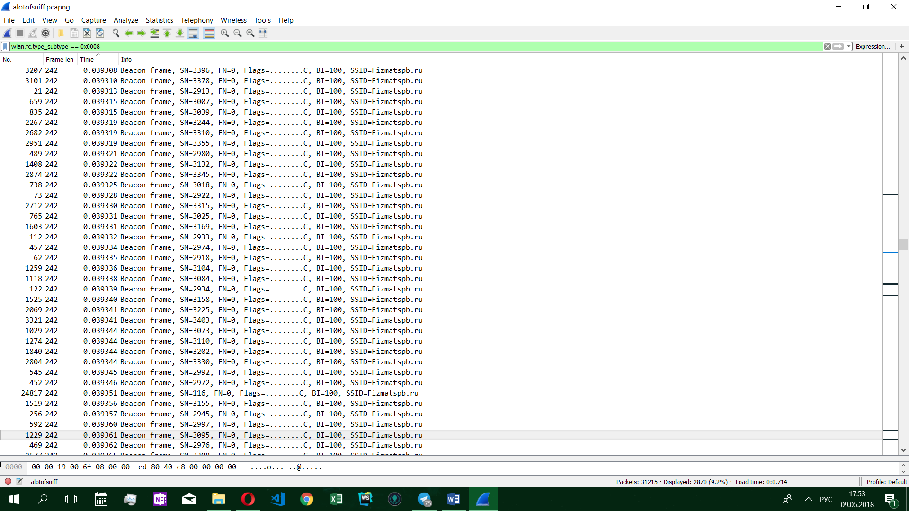
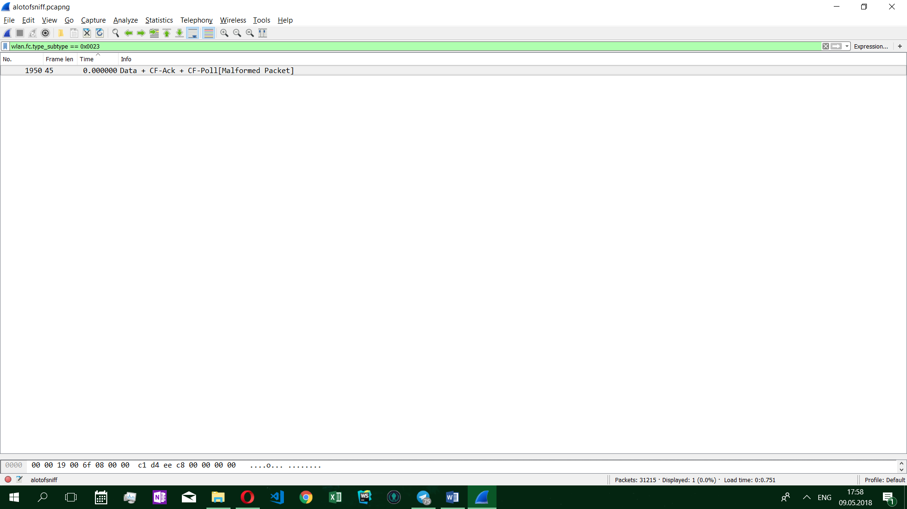
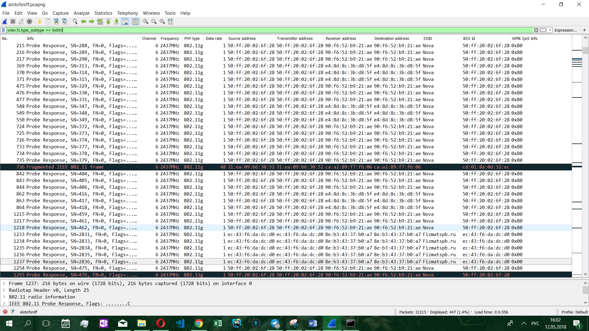

МИНИСТЕРСТВО ОБРАЗОВАНИЯ И НАУКИ РОССИЙСКОЙ ФЕДЕРАЦИИ\
ФЕДЕРАЛЬНОЕ ГОСУДАРСТВЕННОЕ АВТОНОМНОЕ ОБРАЗОВАТЕЛЬНОЕ УЧРЕЖДЕНИЕ
ВЫСШЕГО ОБРАЗОВАНИЯ

«Санкт-Петербургский национальный исследовательский университет

информационных технологий, механики и оптики»

Факультет информационных технологий и программирования

Кафедра информационных систем

Лабораторная работа № 7

Исследование процессов организации обмена данными в беспроводных
локальных сетях связи

> Выполнил студент группы №M3205\
> Баркалов Максим Максимович
>
> Проверил
>
> Аксенов Владимир Олегович

САНКТ--ПЕТЕРБУРГ

2018

Цель работы: Формирование навыков по использованию основных программных
инструментов анализа сетевого трафика для поиска и устранения
неисправностей, связанных с обменом данными в беспроводных локальных
сетях связи.

Для каждого вида кадра делаем скриншот.

{width="7.873611111111111in"
height="1.988888888888889in"}Рис. 5.1.1- «Кадр управления отображение по
видам»

{width="7.873611111111111in"
height="1.7673611111111112in"}

Рис. 5.1.2 - «Кадр контроля отображение по видам»

{width="7.873611111111111in"
height="2.138888888888889in"}

Рис. 5.1.3 - «Кадр данных отображение по видам»

Таблица 5.1 --

  Тип кадра         Вид кадра                      Порядковый номер
  ----------------- ------------------------------ ------------------
  Кадр Управления   Beacon frame                   19
                    Probe Response                 37
                    Fragmented IEEE                126
                    Reassotiation Request          153
                    Action                         470
                    Dissassociate                  496
                    Deauthentication               657
                    Reassotiation Request          854
                    Unrecognized(Reserved frame)   1126
                    Probe Request                  1248
                    ATIM                           11454
                    Aruba Management               13764
  Кадр Контроля     Clear-to-end                   1
                    802.11 Block Ack               2
                    Acknoledgement                 3
                    802.11 Block Ack Req           4
                    Request-to-end                 5
                    Unrecognized(Reserved flame)   69
                    VHT NDP Announcement           1540
  Кадр Данных       QoS Data                       6
                    QoS CF-Ask+CF-Poll             93
                    Null function(No data)         117
                    QoS Null function(No data)     467
                    Unrecognized(Reserved frame)   721
                    Data                           965
                    Data+ CF-Ask                   1950
                    CF-Poll (No data)              2022
                    Fragmented IEEE                2511
                    I                              3105
                    Acknoledgement (No data)       3280
                    S                              4545
                    S F                            5753
                    Key                            11326
                    CF-Ask/Poll                    21807
                    Data\[Malformed Packet\]       25765
                    I P                            29519

{width="7.873611111111111in"
height="4.144444444444445in"}

Рис. 5.2.1.1 - «\<association request\> количество кадров»

{width="7.873611111111111in"
height="4.429166666666666in"}

Рис. 5.2.2.1 - «\<association response\> количество кадров»

{width="7.873611111111111in"
height="4.429166666666666in"}

Рис. 5.2.3.1 - «\<reassociation request\> количество кадров»

{width="7.873611111111111in"
height="4.429166666666666in"}

Рис. 5.2.4.1 - «\<reassociation response\> количество кадров»

{width="7.873611111111111in"
height="4.429166666666666in"}

Рис. 5.2.5.1 - «\<probe request\> количество кадров»

{width="7.873611111111111in"
height="4.429166666666666in"}

Рис. 5.2.6.1 - «\<probe response\> количество кадров»

{width="7.873611111111111in"
height="4.429166666666666in"}

Рис. 5.2.7.1 - «\<beacon\> количество кадров»

{width="7.873611111111111in"
height="4.429166666666666in"}

Рис. 5.2.8.1 - «\<ATIM\> количество кадров»

{width="7.873611111111111in"
height="4.429166666666666in"}

Рис. 5.2.9.1 - «\<Disassociation\> количество кадров»

{width="7.873611111111111in"
height="4.429166666666666in"}

Рис. 5.2.10.1 - «\<Authentication\> количество кадров»

{width="7.873611111111111in"
height="4.429166666666666in"}

Рис. 5.2.11.1 - «\<Deauthentication\> количество кадров»

{width="7.873611111111111in"
height="4.429166666666666in"}

Рис. 5.2.12.1 - «\<Action\> количество кадров»

{width="7.873611111111111in"
height="4.429166666666666in"}

Рис. 5.2.13.1 - «\<Action No Ack\> количество кадров»

{width="7.873611111111111in"
height="4.429166666666666in"}

Рис. 5.2.14.1 - «\<Timing advertisement\> количество кадров»

{width="7.873611111111111in"
height="4.429166666666666in"}

Рис. 5.2.15.1 - «\<Power Save Poll, PS-Poll \> количество кадров»

{width="7.873611111111111in"
height="4.429166666666666in"}

Рис. 5.2.16.1 - «\<Request to Send, RTS \> количество кадров»

{width="7.873611111111111in"
height="4.429166666666666in"}

Рис. 5.2.17.1 - «\<Clear to Send, CTS\> количество кадров»

{width="7.873611111111111in"
height="4.429166666666666in"}

Рис. 5.2.18.1 - «\<Acknowledgement, ACK\> количество кадров»

{width="7.873611111111111in"
height="4.429166666666666in"}

Рис. 5.2.19.1 - «\<Contention Free-End, CF-End\> количество кадров»

{width="7.873611111111111in"
height="4.429166666666666in"}

Рис. 5.2.20.1 - «\<CF-End + CF-ACK\> количество кадров»

{width="7.873611111111111in"
height="4.429166666666666in"}

Рис. 5.2.21.1 - «\<Block ACK Request, BlockAckReq\> количество кадров»

{width="7.873611111111111in"
height="4.429166666666666in"}

Рис. 5.2.22.1 - «\<Block ACK, BlockAck\> количество кадров»

{width="7.873611111111111in"
height="4.429166666666666in"}

Рис. 5.2.23.1 - «\<Data frame\> количество кадров»

{width="7.873611111111111in"
height="4.429166666666666in"}

Рис. 5.2.24.1 - «\<Null function\> количество кадров»

{width="7.873611111111111in"
height="4.429166666666666in"}

Рис. 5.2.25.1 - «\<Data + CF-ACK\> количество кадров»

{width="7.873611111111111in"
height="4.429166666666666in"}

Рис. 5.2.26.1 - «\<Data + CF Poll\> количество кадров»

{width="7.873611111111111in"
height="4.429166666666666in"}

Рис. 5.2.27.1 - «\<Data + CF-ACK + CF-Poll\> количество кадров»

{width="7.873611111111111in"
height="4.429166666666666in"}

Рис. 5.2.28.1 - «\<CF-ACK\> количество кадров»

{width="7.873611111111111in"
height="4.429166666666666in"}

Рис. 5.2.29.1 - «\<CF-Poll\> количество кадров»

{width="7.873611111111111in"
height="4.429166666666666in"}

Рис. 5.2.30.1 - «\<CF-ACK + CF-Poll\> количество кадров»

{width="7.873611111111111in"
height="4.429166666666666in"}

Рис. 5.2.31.1 - «\<QoS Data\> количество кадров»

{width="7.873611111111111in"
height="4.429166666666666in"}

Рис. 5.2.32.1 - «\<QoS Null\> количество кадров»

{width="7.873611111111111in"
height="4.429166666666666in"}

Рис. 5.2.33.1 - «\<QoS Data + CF-ACK\> количество кадров»

{width="7.873611111111111in"
height="4.429166666666666in"}

Рис. 5.2.34.1 - «\<QoS Data + CF-Poll\> количество кадров»

{width="7.873611111111111in"
height="4.429166666666666in"}

Рис. 5.2.35.1 - «\<QoS Data + CF-ACK + CF-Poll\> количество кадров»

{width="7.873611111111111in"
height="4.429166666666666in"}

Рис. 5.2.36.1 - «\<QoS CF-Poll\> количество кадров»

{width="7.873611111111111in"
height="4.429166666666666in"}

Рис. 5.2.37.1 - «\<QoS CF-ACK + CF-Poll\> количество кадров»

{width="7.873611111111111in"
height="4.429166666666666in"}

Рис. 5.2.1.2 - «\<association request\> размеры кадров»

{width="7.873611111111111in"
height="4.429166666666666in"}

Рис. 5.2.2.2 - «\<association response\> размеры кадров»

{width="7.873611111111111in"
height="4.429166666666666in"}

Рис. 5.2.3.2 - «\<reassociation request\> размеры кадров»

{width="7.873611111111111in"
height="4.429166666666666in"}

Рис. 5.2.4.2 - «\<reassociation response\> размеры кадров»

{width="7.873611111111111in"
height="4.429166666666666in"}

Рис. 5.2.5.2 - «\<probe request\> размеры кадров»

{width="7.873611111111111in"
height="4.429166666666666in"}

Рис. 5.2.6.2 - «\<probe response\> размеры кадров»

{width="7.873611111111111in"
height="4.429166666666666in"}

Рис. 5.2.7.2 - «\<beacon\> размеры кадров»

{width="7.873611111111111in"
height="4.429166666666666in"}

Рис. 5.2.8.2 - «\<ATIM\> размеры кадров»

{width="7.873611111111111in"
height="4.429166666666666in"}

Рис. 5.2.9.2 - «\<Disassociation\> размеры кадров»

{width="7.873611111111111in"
height="4.429166666666666in"}

Рис. 5.2.10.2 - «\<Authentication\> размеры кадров»

{width="7.873611111111111in"
height="4.429166666666666in"}

Рис. 5.2.11.2 - «\<Deauthentication\> размеры кадров»

{width="7.873611111111111in"
height="4.429166666666666in"}

Рис. 5.2.12.2 - «\<Action\> размеры кадров»

{width="7.873611111111111in"
height="4.429166666666666in"}

Рис. 5.2.13.2 - «\<Action No Ack\> размеры кадров»

{width="7.873611111111111in"
height="4.429166666666666in"}

Рис. 5.2.14.2 - «\<Timing advertisement\> размеры кадров»

{width="7.873611111111111in"
height="4.429166666666666in"}

Рис. 5.2.15.2 - «\<Power Save Poll, PS-Poll \> размеры кадров»

{width="7.873611111111111in"
height="4.429166666666666in"}

Рис. 5.2.16.2 - «\<Request to Send, RTS \> размеры кадров»

{width="7.873611111111111in"
height="4.429166666666666in"}

Рис. 5.2.17.2 - «\<Clear to Send, CTS\> размеры кадров»

{width="7.873611111111111in"
height="4.429166666666666in"}

Рис. 5.2.18.2 - «\<Acknowledgement, ACK\> размеры кадров»

{width="7.873611111111111in"
height="4.429166666666666in"}

Рис. 5.2.19.2 - «\<Contention Free-End, CF-End\> размеры кадров»

{width="7.873611111111111in"
height="4.429166666666666in"}

Рис. 5.2.20.2 - «\<CF-End + CF-ACK\> размеры кадров»

{width="7.873611111111111in"
height="4.429166666666666in"}

Рис. 5.2.21.2 - «\<Block ACK Request, BlockAckReq\> размеры кадров»

{width="6.583333333333333in"
height="3.703343175853018in"}

Рис. 5.2.22.2 - «\<Block ACK, BlockAck\> размеры кадров»

{width="7.873611111111111in"
height="4.429166666666666in"}

Рис. 5.2.23.2 - «\<Data frame\> размеры кадров»

{width="7.873611111111111in"
height="4.429166666666666in"}

Рис. 5.2.24.2 - «\<Null function\> размеры кадров»

{width="7.873611111111111in"
height="4.429166666666666in"}

Рис. 5.2.25.2 - «\<Data + CF-ACK\> размеры кадров»

{width="7.873611111111111in"
height="4.429166666666666in"}

Рис. 5.2.26.2 - «\<Data + CF Poll\> размеры кадров»

{width="7.873611111111111in"
height="4.429166666666666in"}

Рис. 5.2.27.2 - «\<Data + CF-ACK + CF-Poll\> размеры кадров»

{width="7.873611111111111in"
height="4.429166666666666in"}

Рис. 5.2.28.2 - «\<CF-ACK\> размеры кадров»

{width="7.873611111111111in"
height="4.429166666666666in"}

Рис. 5.2.29.2 - «\<CF-Poll\> размеры кадров»

{width="7.873611111111111in"
height="4.429166666666666in"}

Рис. 5.2.30.2 - «\<CF-ACK + CF-Poll\> размеры кадров»

{width="7.873611111111111in"
height="4.429166666666666in"}

Рис. 5.2.31.2 - «\<QoS Data\> размеры кадров»

{width="7.873611111111111in"
height="4.429166666666666in"}

Рис. 5.2.32.2 - «\<QoS Null\> размеры кадров»

{width="7.873611111111111in"
height="4.429166666666666in"}

Рис. 5.2.33.2 - «\<QoS Data + CF-ACK\> размеры кадров»

{width="7.873611111111111in"
height="4.429166666666666in"}

Рис. 5.2.34.2 - «\<QoS Data + CF-Poll\> размеры кадров»

{width="7.873611111111111in"
height="4.429166666666666in"}

Рис. 5.2.35.2 - «\<QoS Data + CF-ACK + CF-Poll\> размеры кадров»

{width="7.873611111111111in"
height="4.429166666666666in"}

Рис. 5.2.36.2 - «\<QoS CF-Poll\> размеры кадров»

{width="7.873611111111111in"
height="4.429166666666666in"}

Рис. 5.2.37.2 - «\<QoS CF-ACK + CF-Poll\> размеры кадров»

{width="7.873611111111111in"
height="4.429166666666666in"}

Рис. 5.2.1.3 - «\<association request\> интервал между кадрами»

{width="7.873611111111111in"
height="4.429166666666666in"}

Рис. 5.2.2.3 - «\<association response\> интервал между кадрами»

{width="7.873611111111111in"
height="4.429166666666666in"}

Рис. 5.2.3.3 - «\<reassociation request\> интервал между кадрами»

{width="7.873611111111111in"
height="4.429166666666666in"}

Рис. 5.2.4.3 - «\<reassociation response\> интервал между кадрами»

{width="7.873611111111111in"
height="4.429166666666666in"}

Рис. 5.2.5.3 - «\<probe request\> интервал между кадрами»

{width="7.873611111111111in"
height="4.429166666666666in"}

Рис. 5.2.6.3 - «\<probe response\> интервал между кадрами»

{width="7.873611111111111in"
height="4.429166666666666in"}

Рис. 5.2.7.3 - «\<beacon\> интервал между кадрами»

{width="7.873611111111111in"
height="4.429166666666666in"}

Рис. 5.2.8.3 - «\<ATIM\> интервал между кадрами»

{width="7.873611111111111in"
height="4.429166666666666in"}

Рис. 5.2.9.3 - «\<Disassociation\> интервал между кадрами»

{width="7.873611111111111in"
height="4.429166666666666in"}

Рис. 5.2.10.3 - «\<Authentication\> интервал между кадрами»

{width="7.873611111111111in"
height="4.429166666666666in"}

Рис. 5.2.11.3 - «\<Deauthentication\> интервал между кадрами»

{width="7.873611111111111in"
height="4.429166666666666in"}

Рис. 5.2.12.3 - «\<Action\> интервал между кадрами»

{width="7.873611111111111in"
height="4.429166666666666in"}

Рис. 5.2.13.3 - «\<Action No Ack\> интервал между кадрами»

{width="7.873611111111111in"
height="4.429166666666666in"}

Рис. 5.2.14.3 - «\<Timing advertisement\> интервал между кадрами»

{width="7.873611111111111in"
height="4.429166666666666in"}

Рис. 5.2.15.3 - «\<Power Save Poll, PS-Poll \> интервал между кадрами»

{width="7.873611111111111in"
height="4.429166666666666in"}

Рис. 5.2.16.3 - «\<Request to Send, RTS \> интервал между кадрами»

{width="7.873611111111111in"
height="4.429166666666666in"}

Рис. 5.2.17.3 - «\<Clear to Send, CTS\> интервал между кадрами»

{width="7.873611111111111in"
height="4.429166666666666in"}

Рис. 5.2.18.3 - «\<Acknowledgement, ACK\> интервал между кадрами»

{width="7.873611111111111in"
height="4.429166666666666in"}

Рис. 5.2.19.3 - «\<Contention Free-End, CF-End\> интервал между кадрами»

{width="7.873611111111111in"
height="4.429166666666666in"}

Рис. 5.2.20.3 - «\<CF-End + CF-ACK\> интервал между кадрами»

{width="7.873611111111111in"
height="4.429166666666666in"}

Рис. 5.2.21.2 - «\<Block ACK Request, BlockAckReq\> интервал между
кадрами»

{width="7.873611111111111in"
height="4.429166666666666in"}

Рис. 5.2.22.3 - «\<Block ACK, BlockAck\> интервал между кадрами»

{width="7.873611111111111in"
height="4.429166666666666in"}

Рис. 5.2.23.3 - «\<Data frame\> интервал между кадрами»

{width="7.873611111111111in"
height="4.429166666666666in"}

Рис. 5.2.24.3 - «\<Null function\> интервал между кадрами»

{width="7.873611111111111in"
height="4.429166666666666in"}

Рис. 5.2.25.3 - «\<Data + CF-ACK\> интервал между кадрами»

{width="7.873611111111111in"
height="4.429166666666666in"}

Рис. 5.2.26.3 - «\<Data + CF Poll\> интервал между кадрами»

{width="7.873611111111111in"
height="4.429166666666666in"}

Рис. 5.2.27.3 - «\<Data + CF-ACK + CF-Poll\> интервал между кадрами»

{width="7.873611111111111in"
height="4.429166666666666in"}

Рис. 5.2.28.3 - «\<CF-ACK\> интервал между кадрами»

{width="7.873611111111111in"
height="4.429166666666666in"}

Рис. 5.2.29.3 - «\<CF-Poll\> интервал между кадрами»

{width="7.873611111111111in"
height="4.429166666666666in"}

Рис. 5.2.30.3 - «\<CF-ACK + CF-Poll\> интервал между кадрами»

{width="7.873611111111111in"
height="4.429166666666666in"}

Рис. 5.2.31.3 - «\<QoS Data\> интервал между кадрами»

{width="7.873611111111111in"
height="4.429166666666666in"}

Рис. 5.2.32.3 - «\<QoS Null\> интервал между кадрами»

{width="7.873611111111111in"
height="4.429166666666666in"}

Рис. 5.2.33.3 - «\<QoS Data + CF-ACK\> интервал между кадрами»

{width="7.873611111111111in"
height="4.429166666666666in"}

Рис. 5.2.34.3 - «\<QoS Data + CF-Poll\> интервал между кадрами»

{width="7.873611111111111in"
height="4.429166666666666in"}

Рис. 5.2.35.3 - «\<QoS Data + CF-ACK + CF-Poll\> интервал между кадрами»

{width="7.873611111111111in"
height="4.429166666666666in"}

Рис. 5.2.36.3 - «\<QoS CF-Poll\> интервал между кадрами»

{width="7.873611111111111in"
height="4.429166666666666in"}

Рис. 5.2.37.3 - «\<QoS CF-ACK + CF-Poll\> интервал между кадрами»

Таблица 5.2 --

  **№**   **Вид кадра**                                                                                                    Количество кадров   Размер кадров   Интервал времени между кадрами
  ------- ---------------------------------------------------------------------------------------------------------------- ------------------- --------------- --------------------------------
  1       Запрос на ассоциацию (association request)                                                                       2                   178 байт        4 секунды 
  2       Ответ на ассоциацию (association response)                                                                       1                   213 байт        - 
  3       Запрос на повторную ассоциацию                                                                                   6                    1000 байт      14 секунд 
          (reassociation request)                                                                                                                              
  4       Ответ на повторную ассоциацию                                                                                    0                    -              - 
          (reassociation response)                                                                                                                             
  5       Пробный запрос (probe request)                                                                                   280                  106 байт       0,45 секунд 
  6       Ответ на пробный запрос (probe response)                                                                         447                  230 байт       0,32 секунды 
  7       Оповещение о параметрах сети (beacon)                                                                            2870                243 байта       0,05 секунд 
  8       Оповещение в режиме энергосбережения                                                                             2                   57 байт         73 секунды 
          (ATIM)                                                                                                                                               
  9       Запрос на разрыв ассоциации (Disassociation)                                                                     5                    1300 байт      31 секунда 
  10      Запрос на аутентификацию (Authentication)                                                                        7                   149 байт        14 секунд 
  11      Оповещение о прекращении аутентификации                                                                          17                  169 байт        7 секунд 
          (Deauthentication)                                                                                                                                   
  12      Запрос на действие(Action)                                                                                       21                   89 байт        6,3 секунды 
  13      Запрос на действие без подтверждения                                                                             3                   734 байт        19 cекунд 
          (Action No Ack)                                                                                                                                      
  14      Оповещение о параметрах синхронизации                                                                            3                   794 байт        13,1 cекунда 
          (Timing advertisement)                                                                                                                               
  15      Запрос на переход в режим энергосбережения                                                                       4                    750 байт        36,4 секунды
          (Power Save Poll, PS-Poll)                                                                                                                           
  16      Запрос на возможность передачи данных                                                                            7194                 45 байт        0,02 секунды 
          (Request to Send, RTS)                                                                                                                               
  17      Подтверждение возможности передачи данных (Clear to Send, CTS)                                                   7158                 39 байт        0,02 секунды 
  18      Подтверждение приема данных (Acknowledgement, ACK)                                                               1021                40 байт         0,14 секунд 
  19      Информирование об окончании режима нерегулируемого доступа к среде передачи (Contention Free-End, CF-End)        0                    -              - 
  20      Информирование об окончании режима нерегулируемого доступа к среде передачи и подтверждение приема данных        3                    1128 байт      5 секунд 
          (CF-End + CF-ACK)                                                                                                                                    
  21      Запрос на отправку подтверждения о приеме последовательности кадров                                              309                 68 байт         0,46 секунд 
          (Block ACK Request, BlockAckReq)                                                                                                                     
  22      Подтверждение о приеме последовательности кадров (Block ACK, BlockAck)                                           5384                 57 байт        0,027 секунд 
  23      Простой кадр данных (Data frame)                                                                                 89                  317 байт         1,42 секунды
  24      Пустой кадр данных (Null function)                                                                               415                 59 байт         0,34 секунды 
  25      Кадр данных с заполненными полями данных подтверждения приема (Data + CF-ACK)                                    0                    -              - 
  26      Кадр данных с заполненными полями данных опроса (Data + CF Poll)                                                 1                    1938 байт      - 
  27      Кадр данных с заполненными полями данных подтверждения приема и опроса                                           1                   45 байт         - 
          (Data + CF-ACK + CF-Poll)                                                                                                                            
  28      Пустой кадр данных с заполненными полями данных подтверждения приема (CF-ACK)                                    1                   362 байта       - 
  29      Пустой кадр данных с заполненными полями данных опроса (CF-Poll)                                                 2                   1232 байта      36,2 секунды 
  30      Пустой кадр данных с заполненными полями данных подтверждения приема и опроса                                    1                   45 байт         - 
          (CF-ACK + CF-Poll)                                                                                                                                   
  31      Кадр данных с установленными метками QoS (QoS Data)                                                              5896                247 байт        0,025 секунд 
  32      Пустой кадр данных с установленными метками QoS (QoS Null)                                                       1                   309 байт        - 
  33      Кадр данных с установленными метками QoS и заполненными полями данных подтверждения приема (QoS Data + CF-ACK)   0                    -              - 
  34      Кадр данных с установленными метками QoS и заполненными полями данных опроса                                     3                   830 байт        13 секунд 
          (QoS Data + CF-Poll)                                                                                                                                 
  35      Кадр данных с установленными метками QoS и заполненными полями данных подтверждения приема и опроса              4                   580 байт        39 cекунд 
          (QoS Data + CF-ACK + CF-Poll)                                                                                                                        
  36      Пустой кадр данных с установленными метками QoS и заполненными полями данных опроса (QoS CF-Poll)                2                    760 байт       7.5 секунды 
  37      Пустой кадр данных с установленными метками QoS и заполненными полями данных подтверждения приема и опроса       4                    1201 байт      38 cекунд 
          (QoS CF-ACK + CF-Poll)                                                                                                                               

{width="7.873611111111111in"
height="4.429166666666666in"}

Рис. 5.3.1.\<Beacon\> Полезная информация

{width="7.873611111111111in"
height="4.429166666666666in"}

Рис. 5.3.2.\<probe request\> Полезная информация

{width="7.873611111111111in"
height="4.429166666666666in"}

Рис. 5.3.3.\< probe response \> Полезная информация

{width="7.873611111111111in"
height="4.429166666666666in"}

Рис. 5.3.4.\< Data frame \> Полезная информация

{width="7.873611111111111in"
height="4.429166666666666in"}

Рис. 5.3.5.\< QoS Data \> Полезная информация

{width="7.873611111111111in"
height="4.429166666666666in"}

Рис. 5.3.6.\< Acknowledgement,ACK\> Полезная информация

Таблица 5.3 -

  -------------------------------------------------------------------------------------------------------------------------------------------------------------------------------------------
  **Вид кадра**                                         **Категория информации**              **Содержание**
  ----------------------------------------------------- ------------------------------------- -----------------------------------------------------------------------------------------------
  Оповещение о параметрах сети (beacon)                 Номер канала                           6

                                                        Рабочая частота                        2437MHz

                                                        Ширина канала                          802.11g

                                                        Скорость передачи                      1

                                                        Адресная информация                    

                                                        Источник (source address)              50:ff:20:02:6f:28,\
                                                                                              ec:43:f6:da:dc:d0

                                                        Передающая сторона                     50:ff:20:02:6f:28,\
                                                                                              ec:43:f6:da:dc:d0

                                                        (transmitter address)                 

                                                        Принимающая сторона                    ff:ff:ff:ff:ff:ff

                                                        (receiver address)                    

                                                        Получатель (destination address)       ff:ff:ff:ff:ff:ff

                                                        Имя сети (SSID)                        Nova,\
                                                                                              Fizmatspb.ru

                                                        Идентификатор сетевого узла (BSSID)    50:ff:20:02:6f:28,\
                                                                                              ec:43:f6:da:dc:d0

  Пробный запрос (probe request)                        Номер канала                           6

                                                        Рабочая частота                        2437MHz

                                                        Ширина канала                          802.11g

                                                        Скорость передачи                      1

                                                        Адресная информация                    

                                                        Источник (source address)              90:f6:52:b9:21:ae

                                                        Передающая сторона                     90:f6:52:b9:21:ae

                                                        (transmitter address)                 

                                                        Принимающая сторона                    ff:ff:ff:ff:ff:ff

                                                        (receiver address)                    

                                                        Получатель (destination address)       ff:ff:ff:ff:ff:ff

                                                        Имя сети (SSID)                        Wiser24

                                                        Идентификатор сетевого узла (BSSID)    ff:ff:ff:ff:ff:ff

  Ответ на пробный запрос (probe response)              Номер канала                           6

                                                        Рабочая частота                        2437MHz

                                                        Ширина канала                          802.11g

                                                        Скорость передачи                      1

                                                        Адресная информация                    

                                                        Источник (source address)              50:ff:20:02:6f:28,\
                                                                                              ec:43:f6:da:dc:d0

                                                        Передающая сторона                     50:ff:20:02:6f:28,\
                                                                                              ec:43:f6:da:dc:d0

                                                        (transmitter address)                 

                                                        Принимающая сторона                    ff:ff:ff:ff:ff:ff

                                                        (receiver address)                    

                                                        Получатель (destination address)       ff:ff:ff:ff:ff:ff

                                                        Имя сети (SSID)                        Nova,\
                                                                                              Fizmatspb.ru

                                                        Идентификатор сетевого узла (BSSID)    50:ff:20:02:6f:28,\
                                                                                              ec:43:f6:da:dc:d0

  Простой кадр данных (Data frame)                      Номер канала                           6

                                                        Рабочая частота                        2437MHz

                                                        Ширина канала                          802.11g

                                                        Скорость передачи                      1

                                                        Адресная информация                    

                                                        Источник (source address)              48:e9:f1:e6:71:4e

                                                        Передающая сторона                     ec:43:f6:da:dc:d0

                                                        (transmitter address)                 

                                                        Принимающая сторона                    01:00:5e:00:00:fb

                                                        (receiver address)                    

                                                        Получатель (destination address)       01:00:5e:00:00:fb

                                                        Имя сети (SSID)                        -

                                                        Идентификатор сетевого узла (BSSID)    48:e9:f1:e6:71:4e

                                                        Протокол сетевого уровня               

                                                        Протокол транспортного уровня          

  Кадр данных с установленными метками QoS (QoS Data)   Номер канала                           6

                                                        Рабочая частота                        2437MHz

                                                        Ширина канала                          802.11g

                                                        Скорость передачи                     72-144.444

                                                        Адресная информация                    

                                                        Источник (source address)              ec:43:f6:da:dc:d0

                                                        Передающая сторона                     ec:43:f6:da:dc:d0

                                                        (transmitter address)                 

                                                        Принимающая сторона                    f0:79:60:1a:74:c4

                                                        (receiver address)                    

                                                        Получатель (destination address)       f0:79:60:1a:74:c4

                                                        Имя сети (SSID)                        -

                                                        Идентификатор сетевого узла (BSSID)    ec:43:f6:da:dc:d0

                                                        Параметры qos                          {width="4.7258836395450565in" height="0.8040419947506562in"}

                                                        Протокол сетевого уровня               

                                                        Протокол транспортного уровня          

  Подтверждение приема данных (Acknowledgement, ACK)    Номер канала                           6

                                                        Рабочая частота                        2437MHz

                                                        Ширина канала                          802.11g

                                                        Скорость передачи                     24

                                                        Адресная информация                    

                                                        Источник (source address)              -

                                                        Передающая сторона                     -

                                                        (transmitter address)                 

                                                        Принимающая сторона                     f0:79:60:1a:74:c4

                                                        (receiver address)                    

                                                        Получатель (destination address)       -

                                                        Имя сети (SSID)                        -

                                                        Идентификатор сетевого узла (BSSID)    -
  -------------------------------------------------------------------------------------------------------------------------------------------------------------------------------------------

6 Выводы

Сделать выводы о типах изученных в работе кадров

\- какие типы были изучены

Были изучены кадры управления, кадры контроля и кадры данных

\- назначение кадров каждого типа

Кадры управления используются для управления связью станций и точек
доступа (например, кадры аутентификации пользователя или отмены
аутентификации)\
Кадры контроля предназначены для проверки правильности передачи
информации (предотвращение коллизий и др)\
Кадры данных содеражт в себе полезные данные

\- какие виды кадров относятся к каждому типу

К кадрам управления относятся:

Association Response

ReassociationRequest

ReassociationResponse

Probe Request

Probe Response

Reserved

Beacon

ATIM

Disassociation

Authentication

Deauthentication

Action

Reserved

К кадрам контроля относятся:

Block Ack

PS-Poll

RTS

CTS

ACK

CF-end

CF-end + CF-ack

К кадрам данных относятся относятся:

Data + CF-ack

Data + CF-poll

Data +CF-ack+CF-poll

Null

CF-ack

CF-poll

CF-ack +CF-poll

QoS data

QoS data + CF-ack

QoS data + CF-poll

QoS data + CF-ack + CF-poll

QoS Null

QoS + CF-poll (no data)

Qos + CF-ack(no data)

Сделать выводы о видах изученных в работе кадров

\- назначение кадров каждого вида

Запрос на ассоциацию --- association request

Ответ на ассоциацию --- association response

Запрос на повторную ассоциацию --- reassociation request

Ответ на повторную ассоциацию --- reassociation response

Пробный запрос --- probe request

Ответ на пробный запрос --- probe response

Оповещение о параметрах сети --- beacon

Оповещение в режиме энергосбережения --- ATIM

Запрос на разрыв ассоциации --- Disassiciation

Запрос на аутентификацию --- Authentication

Оповещение о прекращении аутентификации --- Deauthentication

Запрос на действие --- Action

Запрос на действие без подтверждения --- Action No Ack

Оповещение о параметрах синхронизации --- Timing advertisement

Запрос на переход в режим энергосбережения ---Power Save Poll, PS-Poll

Запрос на возможность передачи данных --- Request to Send, RTS

Подтверждение возможности передачи данных --- Clear to Send, CTS

Подтверждение приема данных --- Acknowledgement, ACK

Информирование об окончании режима нерегулируемого доступа к среде
передачи --- Contention Free-End, CF-End

Информирование об окончании режима нерегулируемого доступа к среде
передачи и подтверждение приема данных --- CF-End + CF-ACK

Запрос на отправку подтверждения о приеме последовательности кадров ---
Block ACK Request, BlockAckReq

Подтверждение о приеме последовательности кадров --- Block ACK, BlockAck

Простой кадр данных --- Data frame

Пустой кадр данных --- Null function

Кадр данных с заполненными полями данных подтверждения приема --- Data +
CF-ACK

Кадр данных с заполненными полями данных опроса --- Data + CF Poll

Кадр данных с заполненными полями данных подтверждения приема и опроса
--- Data + CF-ACK + CF-Poll

Пустой кадр данных с заполненными полями данных подтверждения приема ---
CF-ACK

Пустой кадр данных с заполненными полями данных опроса --- CF-Poll

Пустой кадр данных с заполненными полями данных подтверждения приема и
опроса --- CF-ACK + CF-Poll

Кадр данных с установленными метками QoS --- QoS Data

Пустой кадр данных с установленными метками QoS --- QoS Null

Кадр данных с установленными метками QoS и заполненными полями данных
подтверждения приема --- QoS Data + CF-ACK

Кадр данных с установленными метками QoS и заполненными полями данных
опроса --- QoS Data + CF-Poll

Кадр данных с установленными метками QoS и заполненными полями данных
подтверждения приема и опроса --- QoS Data + CF-ACK + CF-Poll

Пустой кадр данных с установленными метками QoS и заполненными полями
данных опроса --- QoS CF-Poll

Пустой кадр данных с установленными метками QoS и заполненными полями
данных подтверждения приема и опроса --- QoS CF-ACK + CF-Poll

\- количество кадров каждого вида (одинаковое или различное?)

Количество кадров изменяется

\- изменения размера кадров каждого вида (постоянный или переменный?)

Размер является переменным

\- интервал времени между кадрами (постоянный или переменный?) и
характер передачи (периодическая передача, передача по событию, передача
по запросу?)

Зависит от вида кадра. Например, существуют кадры, отправляемые
регулярно для возможности обнаружения точки доступа (beacon). Есть
кадры, которые запрашивают что-либо (request), есть кадры, которые
отвечают на запросы (response).

Сделать выводы о информации, содержащейся в отдельных видах кадров

\- категории информации\
Служебная информация и непосредственно полезные данные

\- назначение информации (для чего может быть использована?)

Информация используется для обеспечения работы беспроводной передачи
данных
