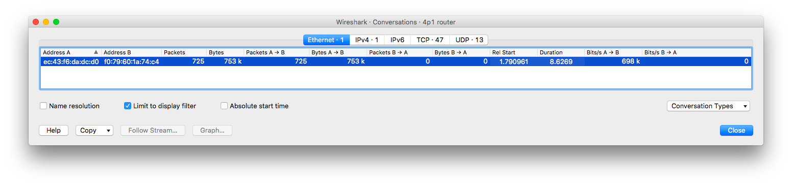
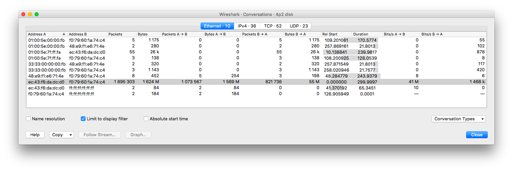
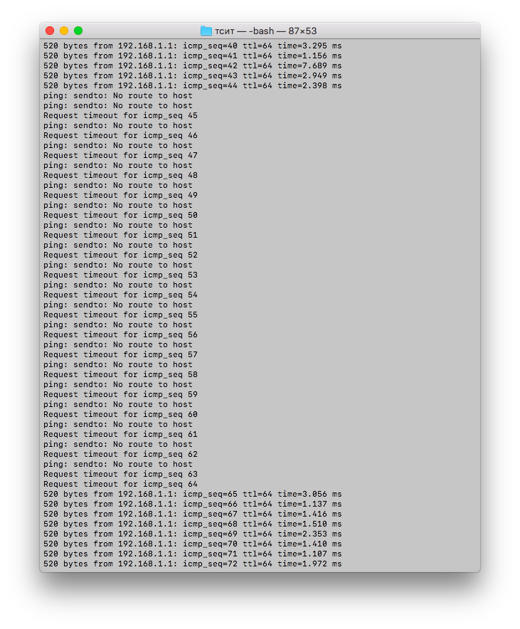
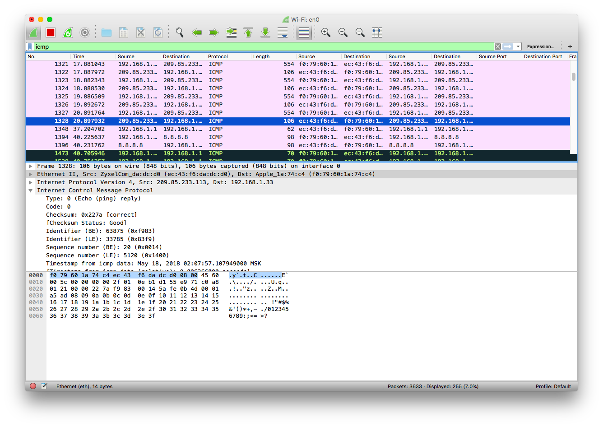
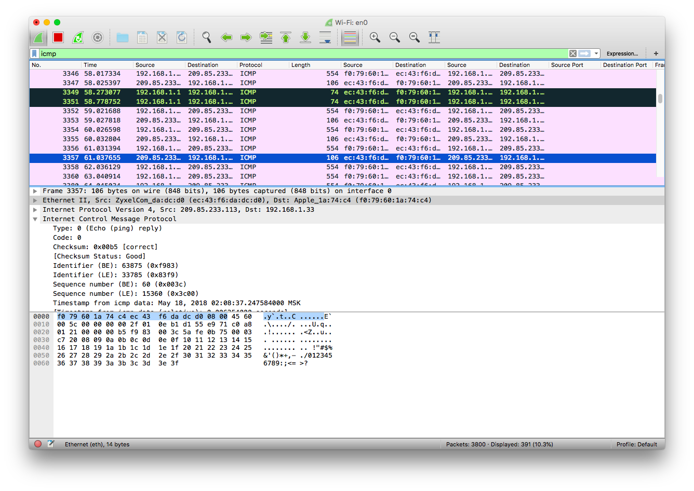

Министерство образования и науки российской федерации\
федеральное государственное автономное образовательное учреждение
высшего образования

«Санкт-Петербургский национальный исследовательский университет
информационных технологий, механики и оптики»

Факультет информационных технологий и программирования

Кафедра информационных систем

Лабораторная работа №8

Изучение основных характеристик производительности сетей связи

Выполнил студент группы №M3205\
Баркалов Максим Максимович

Проверил:\
Аксенов Владимир Олегович

Цель работы: Формирование навыков по оцениванию основных показателей
производительности сетей связи -- скорости передачи, задержки передачи,
разброса задержки передачи, потерь при передаче.

1.  Произведем измерение скорости передачи данных в канале между двумя
    > сетевыми устройствами, подключенными к одной локальной сети (канал
    > через локальную сеть).\
    > Для этого необходимо запустить захват пакетов в программе
    > Wireshark, организовать подключение к роутеру, например, через
    > браузер, и использовать это подключение необходимое время (к
    > примеру, переходить на различные страницы веб-интерфейса). Далее
    > необходимо сформировать выборку только необходимых пакетов, а
    > затем открыть окно "Conversations" и включить режим "Limit to
    > display filter".\
    > В направлении от ПК к маршрутизатору:\
    > a)\
    > {width="6.988888888888889in"
    > height="1.6493055555555556in"}Рисунок 1.1 Канал LAN скорость
    > передачи к маршрутизатору, выборка 10 секунд\
    > \
    > Средняя скорость передачи составила 68 кбит/с\
    > b)\
    > {width="6.988888888888889in"
    > height="3.1319444444444446in"} Рисунок 1.2 Канал LAN скорость
    > передачи к маршрутизатору, выборка 60 секунд\
    > \
    > Средняя скорость передачи составила 28 кбит/с

> c)\
> {width="6.988888888888889in"
> height="1.6895833333333334in"} Рисунок 1.3 Канал LAN скорость передачи
> к маршрутизатору, выборка 300 секунд\
> \
> Средняя скорость передачи составила 16 кбит/с
>
> В направлении от маршрутизатора к ПК:\
> a)\
> {width="6.988888888888889in"
> height="1.6493055555555556in"} Рисунок 1.4 Канал LAN скорость передачи
> к ПК, выборка 10 секунд
>
> Средняя скорость передачи составила 698 кбит/с
>
> b\)
>
> {width="6.988888888888889in"
> height="3.1319444444444446in"} Рисунок 1.5 Канал LAN скорость передачи
> к ПК, выборка 60 секунд\
> \
> Средняя скорость передачи составила 216 кбит/с
>
> c)\
> {width="6.988888888888889in"
> height="1.6895833333333334in"} Рисунок 1.6 Канал LAN скорость передачи
> к ПК, выборка 300 секунд\
> \
> Средняя скорость передачи составила 296 кбит/с
>
> Таблица 1. LAN скорость передачи

  Время, секунд   Скорость к ПК, кбит/с   Скорость к маршрутизатору, кбит/с
  --------------- ----------------------- -----------------------------------
  10              698                     68
  60              216                     28
  300             296                     16

В сети LAN наибольшая скорость передачи наблюдается в первые 10 секунд.
Это связано с тем, что при первоначальном заходе в веб-интерфейс роутера
происходит загрузка всех изображений и стилей. Дальше передается лишь
служебная информация, которая занимает мало места.

2.  Произведем измерение скорости передачи данных в канале между двумя
    сетевыми устройствами, подключенными к разным локальным сетям (канал
    через глобальную сеть).\
    2.1 До вебсервера\
    а) {width="6.988888888888889in"
    height="1.7583333333333333in"}Рисунок 2.1.1 Канал WAN скорость
    передачи при работе с вебсервером, выборка 10 секунд

Средняя скорость download 444 кбит/с, upload 87 кбит/с

b)\
{width="6.988888888888889in"
height="1.7583333333333333in"} Рисунок 2.1.2 Канал WAN скорость передачи
при работе с вебсервером, выборка 60 секунд

Средняя скорость download 818 кбит/с, upload 94 кбит/с

c)\
{width="6.988888888888889in"
height="1.7583333333333333in"} Рисунок 2.1.3 Канал WAN скорость передачи
при работе с вебсервером, выборка 300 секунд

Средняя скорость download 365 кбит/с, upload 72 кбит/с

2.  До файлового сервера

> a\)

{width="6.314519903762029in"
height="2.1132075678040243in"}

Рисунок 2.2.1 Канал WAN скорость передачи при работе с файловым
сервером, выборка 10 секунд

Средняя скорость download 22 мбит/с, upload 819 кбит/с

b){width="6.988888888888889in"
height="2.338888888888889in"}

Рисунок 2.2.2 Канал WAN скорость передачи при работе с файловым
сервером, выборка 60 секунд

Средняя скорость download 44 мбит/с, upload 1550 кбит/с\
\
c){width="6.7530402449693785in"
height="2.25996062992126in"} Рисунок 2.2.3 Канал WAN скорость передачи
при работе с файловым сервером, выборка 300 секунд

> Средняя скорость download 41 мбит/с, upload 1468 кбит/с

2.3 До видеосервера\
a) {width="6.988888888888889in"
height="2.338888888888889in"}Рисунок 2.3.1 Канал WAN скорость передачи
при работе с видеосервером, выборка 10 секунд

> Средняя скорость download 5846 кбит/с, upload 230 кбит/с

b)\
{width="6.988888888888889in"
height="2.338888888888889in"}Рисунок 2.3.2 Канал WAN скорость передачи
при работе с видеосервером, выборка 60 секунд

> Средняя скорость download 4813 кбит/с, upload 164 кбит/с

c){width="6.988888888888889in"
height="2.338888888888889in"}\
\
Рисунок 2.3.3 Канал WAN скорость передачи при работе с видеосервером,
выборка 300 секунд

> Средняя скорость download 4494 кбит/с, upload 150 кбит/с
>
> Таблица 2. WAN скорость передачи

  Тип сервера       Время, секунд   Скорость download   Скорость upload
  ----------------- --------------- ------------------- -----------------
  Web-сервер        10              444 кбит/с          89 кбит/с
                    60              818 кбит/с          94 кбит/с
                    300             365 кбит/с          72 кбит/с
  Файловый сервер   10              22 мбит/с           819 кбит/с
                    60              44 мбит/с           1550 кбит/с
                    300             41 мбит/с           1468 кбит/с
  Видеосервер       10              5846 кбит/с         230 кбит/с
                    60              4813 кбит/с         164 кбит/с
                    300             4494 кбит/с         150 кбит/с

> В сети WAN наибольшая скорость в 44 мбит/с зафиксирована при загрузке
> файла. Нетрудно заметить, что загрузка файла --- самая большая
> операция по загрузке данных. Также важно обратить внимание на скорость
> upload: здесь она тоже самая большая (до 1550кбит/с), это связано с
> особенностью скачивания: большой файл невозможно поместить в один
> пакет, поэтому необходимо передавать на сервер запрос необходимой в
> данный момент части файла.

3.  Измерим задержку и разброс задержки (джиттер) передачи данных в
    канале между двумя сетевыми устройствами, подключенными к одной
    локальной сети (канал через локальную сеть).

3.1 Рассчитаем с помощью утилиты ping

> {width="6.805555555555555in"
> height="3.3333333333333335in"}
>
> Рисунок 3.1 Канал LAN задержка передачи утилита Ping
>
> Минимальная задержка 2.938 ms\
> Средняя задержка 5.053 ms\
> Максимальная задержка 9.371 ms
>
> Рассчитаем с помощью утилиты Wireshark\
> {width="6.149266185476815in"
> height="4.947397200349957in"} Рисунок 3.2 Канал LAN задержка передачи
> утилита Wireshark\
> Для определения средней задержки выберем AVG в стобце Y Axis\
> {width="4.473871391076115in"
> height="3.5994564741907262in"}\
> Рисунок 3.3 Канал LAN средняя задержка передачи утилита Wireshark
>
> Минимальная задержка 2.9 ms\
> Средняя задержка 4.95 ms\
> Максимальная задержка 9.25 ms

4.  Измерим задержку и разброс задержки (джиттер) передачи данных в
    канале между двумя сетевыми устройствами, подключенными к разным
    локальным сетям (канал через глобальную сеть)\
    4.1 До вебсервера\
    4.1.1 При помощи ping\
    {width="6.722222222222222in"
    height="3.1527777777777777in"}

> Рисунок 4.1.1 Канал WAN задержка передачи утилита Ping
>
> Минимальная задержка 11.736 ms\
> Средняя задержка 12.895 ms\
> Максимальная задержка 16.437 ms
>
> 4.1.2 При помощи Wireshark

{width="5.947226596675415in"
height="4.784846894138233in"}

> Рисунок 4.1.2 Канал WAN задержка передачи утилита Wireshark
>
> Минимальная задержка 11.5 ms\
> Средняя задержка 12.75 ms\
> Максимальная задержка 16.25 ms

2.  До файлового сервера

4.2.1 При помощи ping\
{width="6.616470909886265in"
height="4.75in"}

> Рисунок 4.2.1 Канал WAN задержка передачи утилита Ping
>
> Минимальная задержка 5.868 ms\
> Средняя задержка 6.648 ms\
> Максимальная задержка 8.271 ms
>
> 4.2.2 При помощи Wireshark

{width="5.0517246281714785in"
height="4.064370078740158in"}

> Рисунок 4.2.2 Канал WAN задержка передачи утилита Wireshark
>
> Минимальная задержка 5.8 ms\
> Средняя задержка 6.52 ms\
> Максимальная задержка 8.2 ms

3.  До видеосервера

4.3.1 При помощи ping\
{width="4.440038276465442in"
height="3.33455927384077in"}

> Рисунок 4.3.1 Канал WAN задержка передачи утилита Ping
>
> Минимальная задержка 5.897 ms\
> Средняя задержка 6.899 ms\
> Максимальная задержка 8.859 ms
>
> 4.3.2 При помощи Wireshark\
> {width="5.319923447069116in"
> height="4.280148731408574in"}
>
> Рисунок 4.3.2 Канал WAN задержка передачи утилита Wireshark
>
> Минимальная задержка 5.8 ms\
> Средняя задержка 6.75 ms\
> Максимальная задержка 8.75 ms\
> \
> Таблица 3 --- сравнение задержки WAN и LAN

  Тип подключения       Ping      Wireshark                                 
  --------------------- --------- ----------- --------- --------- --------- ---------
                        Min, ms   Avg, ms     Max, ms   Min, ms   Avg, ms   Max, ms
  LAN                   2,938     5,053       9,371     2,9       4,95      9,25
  WAN вебсервер         11,736    12,895      16,437    11,5      12,75     16,25
  WAN файловый сервер   5,868     6,648       8,271     5,8       6,52      8,2
  WAN видеосервер       5,897     6,899       8,859     5,8       6,75      8,75

> Наименьшая задержка зафиксирована в локальной сети: это ожидаемо:
> устройства находятся в непосредственной физической близости друг к
> другу. Наибольшая задержка у web-сервера, а средняя у видео- и
> файлового серверов: для последних двух важна скорость отклика, чтобы
> не было задержек при потоковой передаче данных. Администраторы таких
> серверов стараются совместно с провайдерами уменьшать задержку. Для
> web-серверов эта цифра менее значима.

5.  Измерим потери при передаче данных в канале между двумя сетевыми
    устройствами, подключенными к одной локальной сети (канал через
    локальную сеть)\
    5.1 При отключении интерфейса на компьютере\
    5.1.1 При помощи
    ping{width="5.146783683289589in"
    height="6.223803587051618in"}\
    Рисунок 5.1.1 Канал LAN потери передачи разрыв соединения --- ping

Потеряно 20 пакетов

5.1.2 При помощи Wireshark\
{width="6.170707567804024in"
height="4.36928258967629in"}

Рисунок 5.1.2 Канал LAN потери передачи разрыв соединения --- Wireshark
часть 1

{width="6.180808180227472in"
height="4.376434820647419in"}

Рисунок 5.1.3 Канал LAN потери передачи разрыв соединения --- Wireshark
часть 2

Получим совпадающий результат в 20 пакетов

5.2 При отключении питания на маршрутизаторе\
5.2.1 При помощи
ping{width="6.222689195100612in"
height="8.676768372703412in"} Рисунок 5.2.1 Канал LAN потери передачи
отключение питания --- ping

Потеряно 35 пакетов

5.2.2 При помощи Wireshark\
{width="6.27171697287839in"
height="4.440804899387577in"}

Рисунок 5.2.2 Канал LAN потери передачи отключение питания --- Wireshark
часть 1

{width="6.423232720909886in"
height="4.5480883639545056in"} Рисунок 5.2.3 Канал LAN потери передачи
отключение питания --- Wireshark часть 2

Получим совпадающий результат в 35 пакетов.

6.  Измерим потери при передаче данных в канале между двумя сетевыми
    устройствами, подключенными к разным локальным сетям (канал через
    глобальную сеть)\
    6.1 До вебсервера\
    6.1.1 При отключении интерфейса

6.1.1.1 С помощью ping\
{width="3.989899387576553in"
height="4.6176202974628175in"}\
Рисунок 6.1.1.1 Канал WAN потери передачи отключение интерфейса
--- ping\
Потеряно 18 пакетов

6.1.1.2 С помощью Wireshark\
{width="5.27171697287839in"
height="3.732736220472441in"}

Рисунок 6.1.1.2 Канал WAN потери передачи отключение интерфейса
--- Wireshark часть 1

{width="5.706060804899388in"
height="4.040281058617673in"}

Рисунок 6.1.1.3 Канал WAN потери передачи отключение интерфейса
--- Wireshark часть 2\
Получим совпадающий результат в 18 пакетов

6.1.2 При отсоединении кабеля к оборудованию провайдера

6.1.2.1 С помощью ping\
{width="4.1402548118985125in"
height="1.3123129921259842in"}

Рисунок 6.1.2.1 Канал WAN потери передачи отключение кабеля --- ping\
Потеряно 8 пакетов

6.1.2.2 С помощью Wireshark

{width="5.626020341207349in"
height="3.9836067366579178in"}

Рисунок 6.1.2.2 Канал WAN потери передачи отключение кабеля
--- Wireshark часть 1

{width="4.873568460192476in"
height="3.450819116360455in"}

Рисунок 6.1.2.3 Канал WAN потери передачи отключение кабеля
--- Wireshark часть 2

Получим совпадающий результат в 8 пакетов

2.  До файлового сервера

6.2.1 При отключении интерфейса

6.2.1.1 С помощью ping\
{width="4.688752187226597in"
height="5.985226377952756in"}\
Рисунок 6.2.1.1 Канал WAN потери передачи отключение интерфейса
--- ping\
Потеряно 19 пакетов

6.2.1.2 С помощью Wireshark\
{width="5.336065179352581in"
height="3.7782994313210847in"}

Рисунок 6.2.1.2 Канал WAN потери передачи отключение интерфейса
--- Wireshark часть 1

{width="5.783970909886264in"
height="4.09544728783902in"}

Рисунок 6.2.1.3 Канал WAN потери передачи отключение интерфейса
--- Wireshark часть 2

Получим совпадающий результат в 19 пакетов

6.2.2 При отсоединении кабеля к оборудованию провайдера

6.2.2.1 С помощью ping\
{width="5.433333333333334in"
height="1.8148458005249344in"}

Рисунок 6.2.2.1 Канал WAN потери передачи отключение кабеля --- ping\
Потеряно 6 пакетов

6.2.2.2 С помощью
Wireshark{width="5.004645669291339in"
height="3.5436307961504814in"}

Рисунок 6.2.2.2 Канал WAN потери передачи отключение кабеля
--- Wireshark часть 1

{width="4.9194838145231845in"
height="3.4833333333333334in"}

Рисунок 6.2.2.3 Канал WAN потери передачи отключение кабеля
--- Wireshark часть 2

Получим совпадающий результат в 6 пакетов

3.  До видеосервера

6.3.1 При отключении интерфейса\
6.3.1.1 С помощью ping\
{width="4.177364391951006in"
height="5.391608705161855in"}\
Рисунок 6.3.1.1 Канал WAN потери передачи отключение интерфейса ---
ping\
Потеряно 19 пакетов

6.3.1.2 С помощью Wireshark\
{width="5.363636264216973in"
height="3.797820428696413in"}\
Рисунок 6.3.1.2 Каынал WAN потери передачи отключение интерфейса
--- Wireshark часть 1

{width="5.471400918635171in"
height="3.874126202974628in"}

Рисунок 6.3.1.3 Канал WAN потери передачи отключение интерфейса
--- Wireshark часть 2\
Получим совпадающий результат в 19 пакетов

6.3.2 При отсоединении кабеля к оборудованию провайдера

6.3.2.1 С помощью ping\
{width="5.587412510936133in"
height="1.7663429571303586in"}

Рисунок 6.3.2.1 Канал WAN потери передачи отключение кабеля --- ping

Потеряно 6 пакетов

6.3.2.2 С помощью Wireshark

> {width="5.436441382327209in"
> height="3.849372265966754in"}

Рисунок 6.3.2.2 Канал WAN потери передачи отключение кабеля
--- Wireshark часть 1

> {width="6.082274715660542in"
> height="4.306666666666667in"}

Рисунок 6.3.2.3 Канал WAN потери передачи отключение кабеля
--- Wireshark часть 2

> Таблица 4 --- потери LAN

  Отключение интерфейса, количество потерянных пакетов   Отключение питания, количество потеряных пакетов
  ------------------------------------------------------ --------------------------------------------------
  20                                                     35

> Таблица 5 --- потери WAN

  Тип сервера       Отключение интерфеса, количество потерянных пакетов   Отключение кабеля провайдера, количество потерянных пакетов
  ----------------- ----------------------------------------------------- -------------------------------------------------------------
  Вебсервер         18                                                    8
  Файловый сервер   19                                                    6
  Видеосервер       19                                                    6

Наибольшая потеря пакетов происходит при отключении интерфейса на
компьютере: дело в том, что компьютер подключается к Wi-Fi сети не сразу
после переподключения интерфейса. Ему нужно время на поиск сети. При
переподключении кабеля провайдера пакетов терется меньше. При этом число
потерь пакетов примерно равно для всех серверов. Количество потерянных
пакетов совпадает при измерении с помощью Ping и Wireshark.

Вывод:\
Изучены три характеристики: скорость, задержка и потери. Средняя
скорость зависит от количества передаваемых данных и выше при скачивании
больших объемов информации. Наименьшая задержка в локальной сети
--- ввиду физической близости устройств. Во внешней сети наименьшая
задержка происходит при взаимодействии с видеосерверами и файловыми
серверами --- это связано с тем, что для данных типов серверов
показатель задержки является критически важным и администраторы данных
сервера стараются его оптимизировать. Показатель потерь не зависит от
сервера назначения и зависит лишь от причиы нарушения передачи данных.
