МИНИСТЕРСТВО ОБРАЗОВАНИЯ И НАУКИ РОССИЙСКОЙ ФЕДЕРАЦИИ\
ФЕДЕРАЛЬНОЕ ГОСУДАРСТВЕННОЕ АВТОНОМНОЕ ОБРАЗОВАТЕЛЬНОЕ УЧРЕЖДЕНИЕ
ВЫСШЕГО ОБРАЗОВАНИЯ

«Санкт-Петербургский национальный исследовательский университет
информационных технологий, механики и оптики»

Кафедра информационных систем

Лабораторная работа №5

**Защита памяти**

> Выполнил студент группы M3105:\
> *Лосицкий Евгений Игоревич*
>
> Проверила:\
> *Артёмова Галина Олеговна*

САНКТ-ПЕТЕРБУРГ\
2017

1.  Глобальный массив

**Массив на 10 элементов**\
*прямой проход*

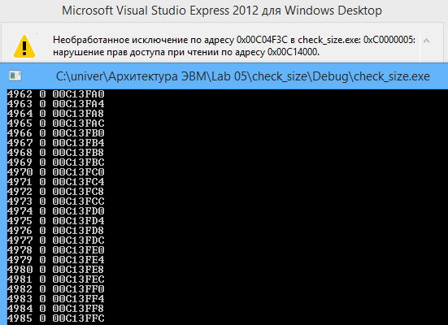{width="5.653543307086614in"
height="4.165354330708661in"}\
*обратный проход\
*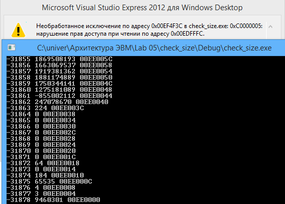{width="5.822916666666667in"
height="4.166666666666667in"}

Массив на 100000 элементов

*прямой проход*

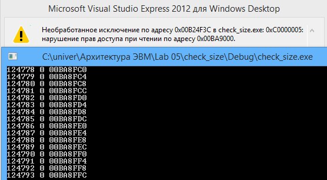{width="5.791666666666667in"
height="3.1979166666666665in"}*\
обратный проход*

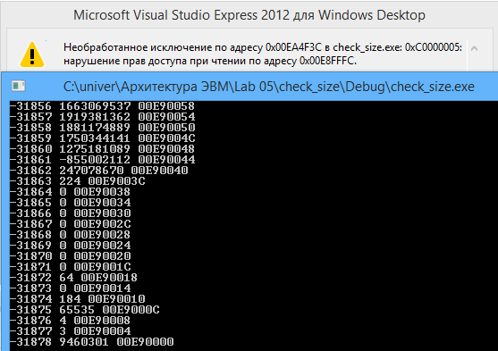{width="5.802083333333333in"
height="4.09375in"}

2.  Локальный массив

Массив на 10 элементов

*прямой проход*

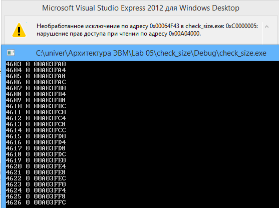{width="5.802083333333333in"
height="4.320833333333334in"}*\
обратный проход*

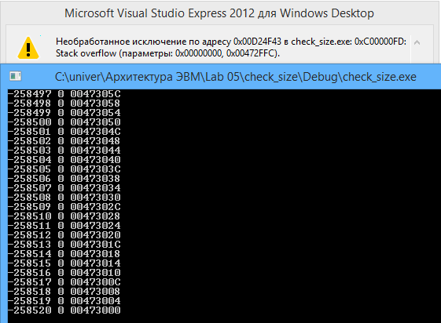{width="5.839583333333334in"
height="4.292361111111111in"}*\
*

Массив на 10000 элементов

*прямой проход*

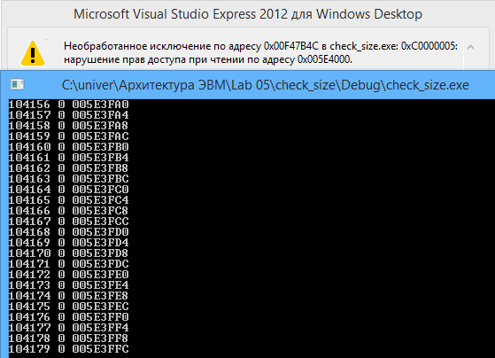{width="5.822916666666667in"
height="4.208333333333333in"}*\
обратный проход*

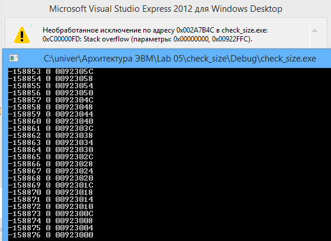{width="5.822916666666667in"
height="4.239583333333333in"}

2.  

```{=html}
<!-- -->
```
3.  Динамический массив

Массив на 10 элементов

прямой проход

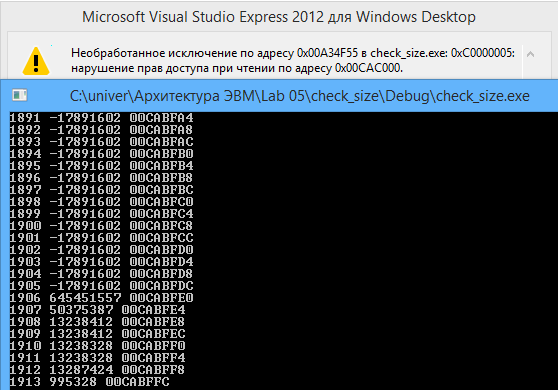{width="5.811111111111111in"
height="4.065972222222222in"}\
обратный проход\
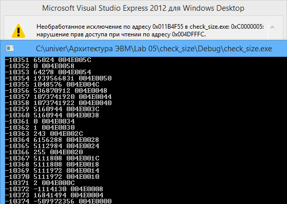{width="5.820833333333334in"
height="4.141666666666667in"}

Массив на 100000 элементов

прямой проход

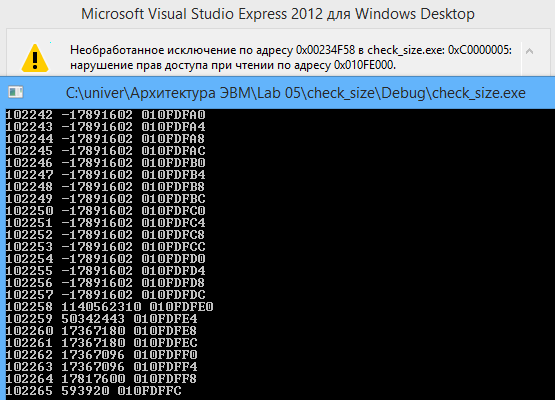{width="5.8in" height="4.2in"}\
обратный проход

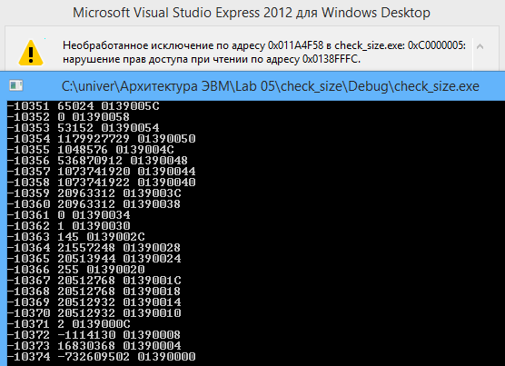{width="5.790972222222222in"
height="4.197916666666667in"}

**Программы**

*Глобальный массив*

\#include \<iostream\>

\#include \<cstdlib\>

using namespace std;

int a\[10\];

int main()

{

for(int i = 0; i \< 1500000; i = i + 1)

{

cout \<\< i \<\< \" \" \<\< a\[i\] \<\< \" \" \<\< &a\[i\] \<\< endl;

}

return 0;

}

*Локальный массив*

\#include \<iostream\>

\#include \<cstdlib\>

using namespace std;

int main()

{

int a\[10\];

for(int i = 0; i \< 1500000; i = i + 1)

{

cout \<\< i \<\< \" \" \<\< a\[i\] \<\< \" \" \<\< &a\[i\] \<\< endl;

}

return 0;

}

*Динамический массив*

\#include \<iostream\>

\#include \<cstdlib\>

using namespace std;

int main()

{

int \*a = (int\*)malloc(sizeof(int)\*10);

for(int i = 0; i \< 1500000; i = i + 1)

{

cout \<\< i \<\< \" \" \<\< a\[i\] \<\< \" \" \<\< &a\[i\] \<\< endl;

}

return 0;

}

**Вывод**

Диапазон адресного пространства, доступного для обращения через массив
ограничен защищенными участками памяти, чтение из которых запрещено. При
обходе в порядке возрастания последний доступный адрес всегда
заканчивается на «FFC», а при обходе в обратном порядке на «000». Это
объясняется страничной организацией памяти, с размером страницы в 4096
байта.

Память, выделяемая для массивов локально и глобально находится на разных
участках оперативной памяти.

Память для глобального массива выделяется в разделе Image(ASLR).\
Память для локального массива выделяется в Thread Stack, то есть в стеке
данных конкретной задачи.\
Память для динамического массива выделяется в Heap.
