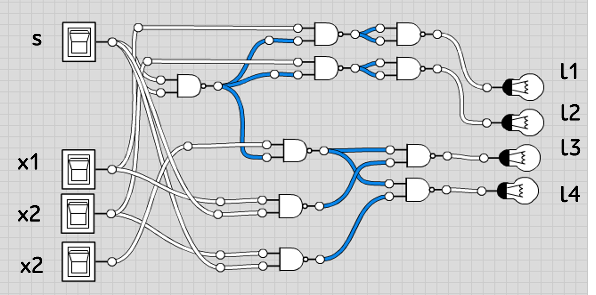
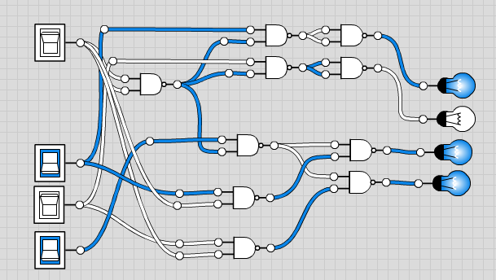
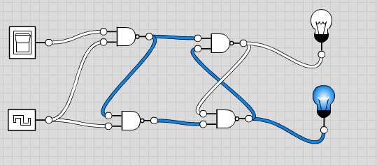
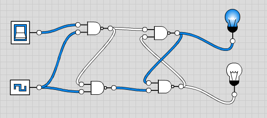
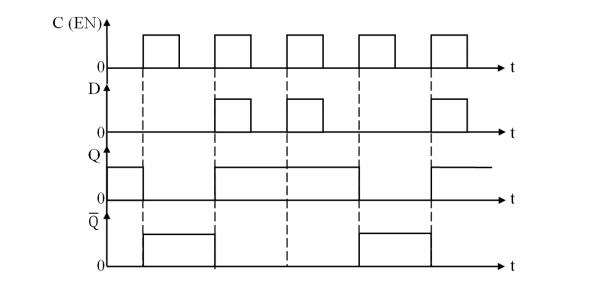

Минимтерство образования и науки Российской федерации\
федеральное государственное автономное образовательное учреждение
высшего образования

«Санкт-Петербургский национальный исследовательский университет\
информационных технологий, механики и оптики»

Факультет информационных технологий и программирования

Кафедра информационных систем

Лабораторная работа № 1

**Исследование комбинационных схем**

> Выполнил студент группы №М3105:\
> Ивницкий Алексей Андреевич
>
> Проверила:\
> Артёмова Галина Олеговна

Санкт-Петербург\
2016

**Задание на лабораторную работу:**

1.  В соответствии с заданием построить схему устройства:

    a.  описать функционирование устройства

        -   Трехразрядный арифметический сдвигатель на 1 разряд.

    b.  построить таблицу истинности

  **x1**   **x2**   **x3**   **s**   **l1**   **l2**   **l3**   **l4**
  -------- -------- -------- ------- -------- -------- -------- --------
  0        0        0        0       0        0        0        0
  0        0        1        0       0        0        1        1
  0        0        0        0       0        0        0        0
  0        0        1        0       0        0        1        1
  0        1        0        0       0        1        0        0
  0        1        1        0       0        1        1        1
  0        1        0        0       0        1        0        0
  0        1        1        0       0        1        1        1
  1        0        0        0       1        0        0        0
  1        0        1        0       1        0        1        1
  1        0        0        0       1        0        0        0
  1        0        1        0       1        0        1        1
  1        1        0        0       1        1        0        0
  1        1        1        0       1        1        1        1
  1        1        0        0       1        1        0        0
  1        1        1        0       1        1        1        1
  0        0        0        1       0        0        0        0
  0        0        1        1       0        0        0        0
  0        0        0        1       0        0        0        0
  0        0        1        1       0        0        0        0
  0        1        0        1       0        0        0        1
  0        1        1        1       0        0        0        1
  0        1        0        1       0        0        0        1
  0        1        1        1       0        0        0        1
  1        0        0        1       0        0        1        0
  1        0        1        1       0        0        1        0
  1        0        0        1       0        0        1        0
  1        0        1        1       0        0        1        0
  1        1        0        1       0        0        1        1
  1        1        1        1       0        0        1        1
  1        1        0        1       0        0        1        1
  1        1        1        1       0        0        1        1

c.  в соответствии с таблицей истинности записать булевы выражения для
    выходов в базисе НЕ-И или НЕ-ИЛИ

  l1   (x1\|(s\|s))\|(x1\|(s\|s))
  ---- ----------------------------
  l2   (x2\|(s\|s))\|(x2\|(s\|s))
  l3   (x3\|(s\|s))\|(x1\|s)
  l4   (x4\|(s\|s))\|(x1\|s)

d.  построить логическую схему в соответствии с полученными выражениями

{width="6.989583333333333in"
height="3.4685509623797026in"}

e.  проверить работу схемы

{width="6.34375in"
height="3.5833333333333335in"}

2.  Рассчитать характеристики полученной схемы:

    a.  сложность = 20

    b.  быстродействие = 3

```{=html}
<!-- -->
```
1.  В соответствии с заданием построить схему устройства:

    a.  описать функционирование устройства

        -   Сигнал на входе Q в такте t+ 1 повторяет входной сигнал D в
            предыдущем такте Dt и сохраняет (запоминает) это состояние
            до следующего тактового импульса, т. е. D-- триггер
            задерживает на один такт информацию, существовавшую на
            входе D.

    b.  построить таблицу истинности

  С   D   Q\_t   Q\_t+1
  --- --- ------ --------
  0   0   0      1
  0   0   1      0
  0   1   0      1
  0   1   1      0
  1   0   0      1
  1   0   1      1
  1   1   0      0
  1   1   1      0

c.  в соответствии с таблицей истинности записать булевы выражения для
    выходов в базисе НЕ-И или НЕ-ИЛИ

    -   Q\_t+1 = ((D\|C) \| C) \| Q\_t

    -   Q\_t = (D\|C) \| Q\_t+1

d.  построить логическую схему в соответствии с полученными выражениями

> {width="5.614583333333333in"
> height="2.4791666666666665in"}

e.  проверить работу схемы

> {width="5.604166666666667in"
> height="2.4895833333333335in"}

2.  Рассчитать характеристики полученной схемы:

    a.  сложность = 8

    b.  быстродействие = 3

3.  Описать функционирование одной из полученных схем с помощью
    временной диаграммы

> {width="6.229166666666667in"
> height="2.96875in"}

Список литературы:

1)  Григорьев Б.И. Элементная база и устройства цифровой техники

2)  http://life-prog.ru/view\_automati.php?id=7
