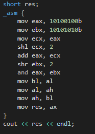
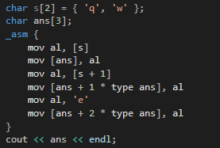

Минимтерство образования и науки Российской федерации\
федеральное государственное автономное образовательное учреждение
высшего образования

«Санкт-Петербургский национальный исследовательский университет\
информационных технологий, механики и оптики»

Факультет информационных технологий и программирования

Кафедра информационных систем

Лабораторная работа № 2

**Изучение архитектуры команд и способов адресации**

> Выполнил студент группы №М3105:\
> Ивницкий Алексей Андреевич
>
> Проверила:\
> Артёмова Галина Олеговна

Санкт-Петербург\
2016\
**Цель работы:** изучение системы команд и способов адресации во
встроенном ассемблере

**Задание на лабораторную работу:**

1)  Задать значение элементов массива

{width="4.125in"
height="5.229166666666667in"}{width="3.7708333333333335in"
height="2.3125in"}

2)  {width="2.3229166666666665in"
    height="0.8854166666666666in"}

3)  Даны два числа в двоичном виде. Первое число умножить на 9, второе
    разделить на 4. результаты логически перемножить и старшую часть
    поменять местами с младшей.

{width="1.9375in"
height="2.4583333333333335in"}

4)  {width="2.7604166666666665in"
    height="0.8333333333333334in"}

{width="2.1458333333333335in"
height="2.4895833333333335in"}

5)  Добавить в конец строки символ (можно ввести свой символ окончания
    строки)

{width="2.8854166666666665in"
height="1.7708333333333333in"}

Список использованной литературы

http://natalia.appmat.ru/c&c++/assembler.html
