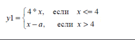
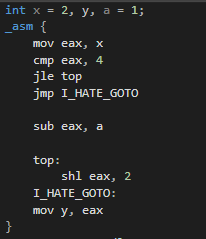
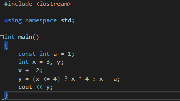
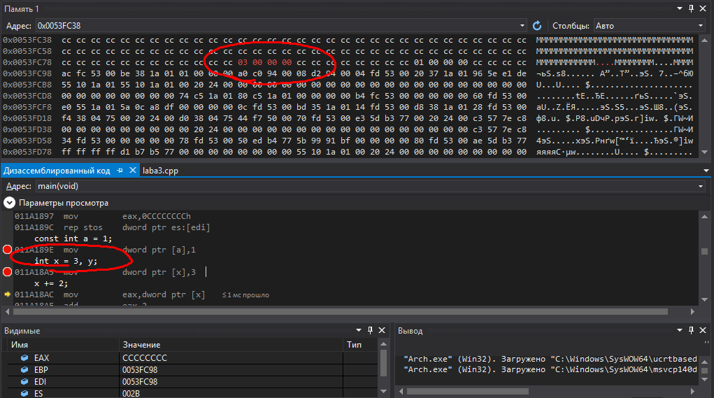
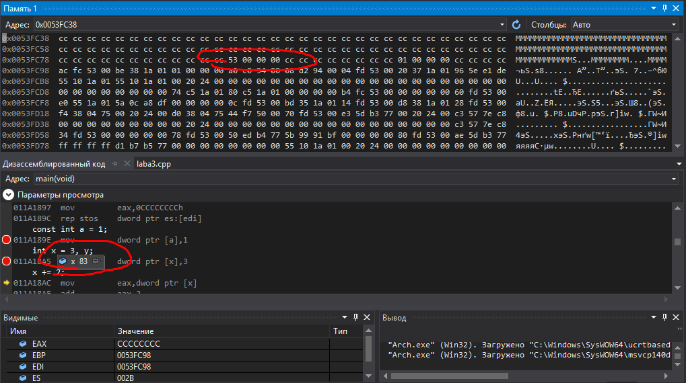

Минимтерство образования и науки Российской федерации\
федеральное государственное автономное образовательное учреждение
высшего образования

«Санкт-Петербургский национальный исследовательский университет\
информационных технологий, механики и оптики»

Факультет информационных технологий и программирования

Кафедра информационных систем

Лабораторная работа № 3

**Дизассемблирование**

> Выполнил студент группы №М3105:\
> Ивницкий Алексей Андреевич
>
> Проверила:\
> Артёмова Галина Олеговна

Санкт-Петербург\
2016\
**Цель работы:** изучение системы команд и способов адресации во
встроенном ассемблере

**Задание на лабораторную работу:**

1)  Написать программу (на языке высокого уровня), соответствующую
    заданию №4 ЛР2 (см. таблицу). Значение переменной должно вводиться
    пользователем с клавиатуры. Значение константы а задано в программе.
    {width="2.7604166666666665in"
    height="0.8333333333333334in"}

2)  Изучить дизассемблерный текст программы в пошаговом исполнении.
    Откомментировать дизассемблерный текст программы.

3)  Сопоставить собственное решение задания №4 ЛР2 и дизассемблерный
    текст программы.

{width="2.1458333333333335in"
height="2.4895833333333335in"}{width="3.71875in"
height="2.09375in"}

4)  При пошаговом исполнении определить адрес переменной и выполнить
    подмену значения в памяти. Показать расчет адреса переменной через
    содержимое регистров процессора.

> {width="6.468068678915135in"
> height="3.6046336395450567in"}{width="6.550005468066492in"
> height="3.6638888888888888in"}

**int** main()

{

00121880 **push** ebp

00121881 **mov** ebp,esp

00121883 **sub** esp,0E8h

00121889 **push** ebx

0012188A **push** esi

0012188B **push** edi

0012188C **lea** edi,\[ebp-0E8h\]

00121892 **mov** ecx,3Ah

00121897 **mov** eax,0CCCCCCCCh

0012189C **rep** **stos** **dword** **ptr** es:\[edi\]

**int** a = 1;

0012189E **mov** **dword** **ptr** \[a\],1

**int** x = 3, y;

001218A5 **mov** **dword** **ptr** \[x\],3

y = (x \<= 4) ? x \* 4 : x - a;

001218AC **cmp** **dword** **ptr** \[x\],4

001218B0 **jg** main+40h (01218C0h)

001218B2 **mov** eax,**dword** **ptr** \[x\]

001218B5 **shl** eax,2

001218B8 **mov** **dword** **ptr** \[ebp-0E8h\],eax

001218BE **jmp** main+4Ch (01218CCh)

001218C0 **mov** ecx,**dword** **ptr** \[x\]

001218C3 **sub** ecx,**dword** **ptr** \[a\]

001218C6 **mov** **dword** **ptr** \[ebp-0E8h\],ecx

001218CC **mov** edx,**dword** **ptr** \[ebp-0E8h\]

001218D2 **mov** **dword** **ptr** \[y\],edx

cout \<\< y;

001218D5 **mov** esi,esp

001218D7 **mov** eax,**dword** **ptr** \[y\]

001218DA **push** eax

001218DB **mov** ecx,**dword** **ptr**
\[\_imp\_?cout@**std**@\@3V?\$basic\_ostream\@DU?\$char\_traits\@D@**std**@@\@1\@A
(012D0DCh)\]

001218E1 **call** dword **ptr**
\[\_\_imp\_std::basic\_ostream\<char,**std**::char\_traits\<char\>
\>::operator\<\< (012D0E8h)\]

001218E7 **cmp** esi,esp

001218E9 **call** \_\_RTC\_CheckEsp (0121163h)

}

001218EE **xor** eax,eax

001218F0 **pop** edi

001218F1 **pop** esi

001218F2 **pop** ebx

001218F3 **add** esp,0E8h

001218F9 **cmp** ebp,esp

001218FB **call** \_\_RTC\_CheckEsp (0121163h)

00121900 **mov** esp,ebp

00121902 **pop** ebp

00121903 **ret**

Список использованной литературы

http://natalia.appmat.ru/c&c++/assembler.html
