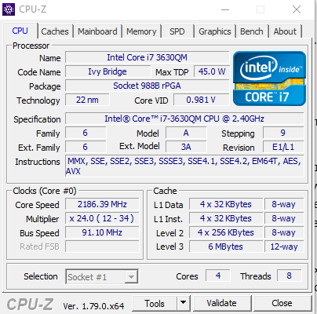
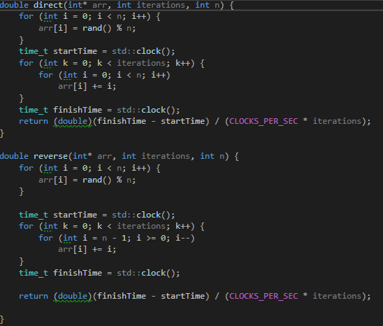
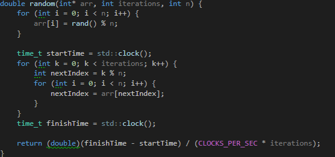
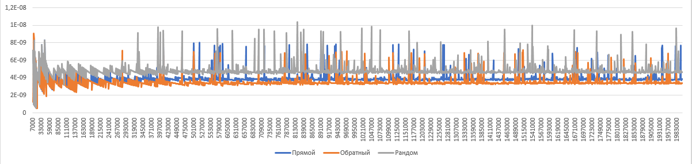
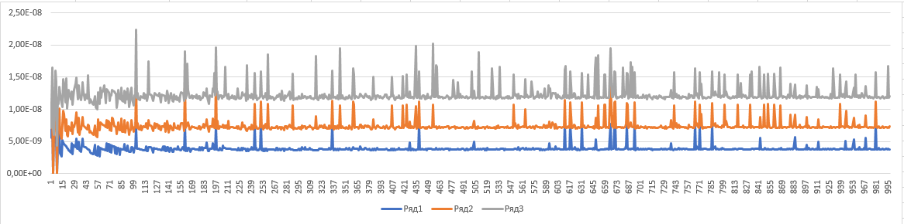

Минимтерство образования и науки Российской федерации\
федеральное государственное автономное образовательное учреждение
высшего образования

«Санкт-Петербургский национальный исследовательский университет\
информационных технологий, механики и оптики»

Факультет информационных технологий и программирования

Кафедра информационных систем

Лабораторная работа № 4

**Влияние характеристик кэш-памяти на скорость вычислений**

> Выполнил студент группы №М3105:\
> Ивницкий Алексей Андреевич
>
> Проверила:\
> Артёмова Галина Олеговна

Санкт-Петербург\
2017\
**Цель работы:** Исследование зависимости времени доступа к данным от
характеристик кэш-памяти

**Задание на лабораторную работу:**

1.  С помощью программы CPU-Z или аналогичной определить характеристики
    кэш-памяти процессора.

{width="4.208333333333333in"
height="4.166666666666667in"}

2.  Для изучения влияния кэш-памяти на скорость доступа к данным
    написать программу, многократно выполняющую обход массива разного
    размера тремя способами: последовательно в сторону увеличения
    адресов, последовательно в сторону уменьшения адресов и в случайном
    порядке.

{width="5.451091426071741in"
height="4.635416666666667in"}{width="5.791666666666667in"
height="2.7291666666666665in"}

3.  Для каждого размера массива и способа обхода измерить среднее время
    доступа к одному элементу. Построить графики зависимости среднего
    времени доступа от размера массива.

{width="6.496527777777778in"
height="1.551388888888889in"}{width="6.496527777777778in"
height="1.6159722222222221in"}

4.  На основе анализа полученных графиков:

    a.  определить размеры кэш-памяти различных уровней, обосновать
        ответ, сопоставить результат с известными реальными значениями;

        Определить размеры по текущим данным невозможно ввиду неточности
        теста. Много фактором влияют на появление шумов

        определить размеры массива, при которых время доступа к элементу
        массива при случайном обходе больше, чем при прямом или
        обратном; объяснить причины этой разницы во временах.

        Почти весь отрезок времени тестов, за исключением некоторых
        точек-шумов.

Список использованной литературы

http://natalia.appmat.ru/c&c++/assembler.html
