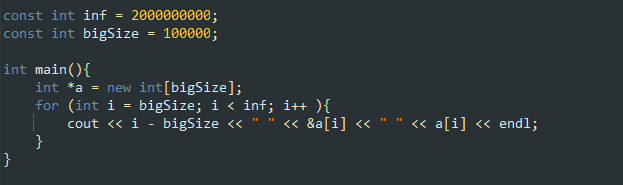

Минимтерство образования и науки Российской федерации\
федеральное государственное автономное образовательное учреждение
высшего образования

«Санкт-Петербургский национальный исследовательский университет\
информационных технологий, механики и оптики»

Факультет информационных технологий и программирования

Кафедра информационных систем

Лабораторная работа № 5

**Защита памяти**

> Выполнил студент группы №М3105:\
> Ивницкий Алексей Андреевич
>
> Проверила:\
> Артёмова Галина Олеговна

Санкт-Петербург\
2017\
**Цель работы:** Исследование исключительных ситуаций по защите памяти

**Задание на лабораторную работу:**

1.  Написать программу, в которой будет определен глобальный массив, а
    также будет реализован цикл, который последовательно обращается к
    каждому элементу массива, выходя за его границы, тем самым нарушая
    защиту области памяти.

> {width="6.489583333333333in"
> height="1.9270833333333333in"}

2.  Реализовать один из методов обработки исключительных ситуаций.

3.  Организовать вывод сообщений, показывающий границы диапазонов
    адресного пространства.

4.  Реализовать следующие случаи обращения к данным с исключительными
    ситуациями: (малое количество вперед / назад, большое количество
    вперед/назад)

    a.  С глобальным массивом;

{width="5.270833333333333in"
height="2.767590769903762in"}

{width="4.031188757655293in"
height="2.09375in"}

{width="4.4325962379702535in"
height="2.3229166666666665in"}

{width="4.770954724409449in"
height="2.5in"}

b.  С локальным массивом;

{width="5.119336176727909in"
height="2.6770833333333335in"}

{width="5.197916666666667in"
height="2.696981627296588in"}

{width="5.177083333333333in"
height="2.707769028871391in"}

{width="5.09375in"
height="2.6718755468066493in"}

c.  С динамическим массивом.

{width="5.104166666666667in"
height="2.6721205161854766in"}

{width="5.143371609798775in"
height="2.6770833333333335in"}

{width="5.125in"
height="2.6777865266841645in"}

{width="4.614583333333333in"
height="2.401466535433071in"}

5.  Определить границы диапазонов адресов, выделенных под разные цели.

Глобальная и локальная память получают память с различных частей
оперативной памяти. К примеру, выделенная под локальную находится ближе
к началу из-за чего выход за нижнюю границу часто сопровождается
попаданием на защищенную память.
