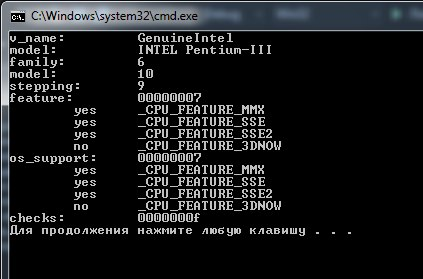
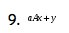
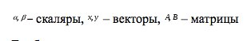

МИНИСТЕРСТВО ОБРАЗОВАНИЯ И НАУКИ РОССИЙСКОЙ ФЕДЕРАЦИИ

ФЕДЕРАЛЬНОЕ ГОСУДАРСТВЕННОЕ АВТОНОМНОЕ ОБРАЗОВАТЕЛЬНОЕ УЧРЕЖДЕНИЕ
ВЫСШЕГО ОБРАЗОВАНИЯ

«Санкт -- Петербургский национальный исследовательский университет
информационных технологий, механики и оптики»

Факультет информационных технологий и программирования

Кафедра информационных систем

Лабораторная работа №6

ВЕКТОРНЫЕ ВЫЧИСЛЕНИЯ

> > Выполнили студенты группы №M3105:
>
> > Малинин Александр Сергеевич\
> > Баркалов Максим Максимович
>
> Проверила
>
> Артемова Галина Олеговна

САНКТ -- ПЕТЕРБУРГ

2017

1.  Векторные возможности процессора:

{width="4.405555555555556in"
height="2.9055555555555554in"}

2.  {width="0.7166666666666667in"
    height="0.34930555555555554in"}

{width="3.2736111111111112in"
height="0.5472222222222223in"}

При обычном способе выполнения данных вычислений программа работала
970мс

При ассемблерных вставках работает 880мс\
При использовании заголовочного файла для данного типа вычислений
программа работала 220мс.

Обычное выполнение вычислении:

\#include \<iostream\>

\#include \<time.h\>

\#include \<fstream\>

using namespace std;

float matrix\[10000\]\[10000\];

int main() {

//ofstream cout(\"out.txt\");

float vector2\[10000\];

float answer\[10000\];

float vector1\[10000\];

srand(time(NULL));

float constant = rand() % 10;

for (int i = 0; i \< 10000; ++i) {

answer\[i\] = 0;

vector1\[i\] = rand() % 10;

vector2\[i\] = rand() % 10;

for (int j = 0; j \< 10000; ++j)

{

matrix\[i\]\[j\] = rand() % 10;

}

}

auto time = clock();

for (int i = 0; i \< 10000; i++)

{

for (int j = 0; j \< 10000; j++)

{

matrix\[i\]\[j\] = matrix\[i\]\[j\] \* constant;

}

}

for (int i = 0; i \< 10000; i++)

{

float sum = 0;

for (int j = 0; j \< 10000; j++)

{

sum = sum + matrix\[i\]\[j\] \* vector1\[j\];

//cout \<\< i \<\< \" \" \<\< j \<\< endl;

}

vector2\[i\] = vector2\[i\] + sum;

}

cout \<\< clock() - time;

return 0;

}

Выполнение вычислений через заголовочный файл:

\#include \<xmmintrin.h\>

\#include \<iostream\>

\#include \<stdio.h\>

\#include \<time.h\>

using namespace std;

float matrix\[10000\]\[10000\];

int main()

{

srand(time(NULL));

float constant\[10000\];

float vector1\[10000\];

float vector2\[10000\];

float b1 = rand() % 10;

for (int i = 0; i \< 10000; ++i)

{

constant\[i\] = b1;

vector1\[i\] = rand() % 10;

vector2\[i\] = rand() % 10;

for (int j = 0; j \< 100000; ++j)

{

matrix\[i\]\[j\] = rand() % 10;

}

//cout \<\< \[i\] \<\< \" \" \<\< b\[i\] \<\< \" \" \<\< vec\[i\] \<\<
\" \" \<\< vec2\[i\] \<\< endl;

}

auto time = clock();

\_\_m128 vect1\[2500\] = { NULL }, vect2\[2500\] = { NULL };

float \*m = &matrix\[0\]\[0\], \*c = &constant\[0\], \*v1 =
&vector1\[0\], \*v2 = &vector2\[0\];

for (int i = 0; i \< 2; ++i)

{

\_\_m128 \*y, \*x1, \*y1, \*z, \*z1, \*z2;

y = reinterpret\_cast\<\_\_m128\*\> (c + 4 \* i);

x1 = reinterpret\_cast\<\_\_m128\*\> (v1 + 4 \* i);

y1 = reinterpret\_cast\<\_\_m128\*\> (v2 + 4 \* i);

vect1\[i\] = \_mm\_mul\_ps(\*y, \*x1);

vect2\[i\] = \*y1;

}

\_\_m128 sum\[10000\] = { NULL };

float newsum\[10000\] = { NULL }, \*ns = &newsum\[0\];

for (int j1 = 0; j1 \< 10000; ++j1)

{

for (int i = 0; i \< 2500; ++i)

{

\_\_m128 \*x, multi;

x = reinterpret\_cast\<\_\_m128\*\> (m + j1 \* 8 + 4 \* i);

multi = \_mm\_mul\_ps(\*x, vect1\[i\]);

sum\[j1\] = \_mm\_add\_ps(sum\[j1\], multi);

}

float prom;

\_mm\_store\_ss(&prom, sum\[j1\]);

newsum\[j1\] += prom;

\_mm\_shuffle\_ps(sum\[j1\], sum\[j1\], 1);

\_mm\_store\_ss(&prom, sum\[j1\]);

newsum\[j1\] += prom;

\_mm\_shuffle\_ps(sum\[j1\], sum\[j1\], 2);

\_mm\_store\_ss(&prom, sum\[j1\]);

newsum\[j1\] += prom;

\_mm\_shuffle\_ps(sum\[j1\], sum\[j1\], 3);

\_mm\_store\_ss(&prom, sum\[j1\]);

newsum\[j1\] += prom;

if ((j1 + 1 % 4) == 0)

{

\_\_m128 \*x;

x = reinterpret\_cast\<\_\_m128\*\> (c + 4 \* ((j1 + 1) / 4));

\*x = \_mm\_add\_ps(\*x, vect2\[(j1 + 1) / 4\]);

\_mm\_store\_ss(&prom, \*x);

newsum\[j1 - 3\] = prom;

\_mm\_shuffle\_ps(\*x, \*x, 1);

\_mm\_store\_ss(&prom, \*x);

newsum\[j1 - 2\] = prom;

\_mm\_shuffle\_ps(\*x, \*x, 2);

\_mm\_store\_ss(&prom, \*x);

newsum\[j1 - 1\] = prom;

\_mm\_shuffle\_ps(\*x, \*x, 3);

\_mm\_store\_ss(&prom, \*x);

newsum\[j1\] = prom;

}

}

/\*for (int i = 0; i \< 8; ++i)

{

cout \<\< newsum\[i\] \<\< endl;

}\*/

cout \<\< clock() - time;

cout \<\< endl;

//(int \*q) = (int\*)(z);

//printf(\"NUM: %f\", q);

return 0;

}

Выполнение вычислений ассемблерными вставками:

\#include \<iostream\>

\#include \<time.h\>

using namespace std;

float matrix\[10000\]\[10000\];

int main()

{

int f = 0;

srand(time(NULL));

float end\[10000\];

float sum\_in\_str\[10000\];

for (int i = 0; i \< 10000; ++i)

{

end\[i\] = 0;

sum\_in\_str\[i\] = 0;

}

float constant\[10000\];

float vector1\[10000\];

float vector2\[10000\];

float c = rand() % 4;

for (int i = 0; i \< 10000; ++i)

{

for (int j = 0; j \< 10000; ++j)

{

matrix\[i\]\[j\] = rand() % 4;

}

}

for (int i = 0; i \< 10000; ++i)

{

constant\[i\] = c;

vector1\[i\] = rand() % 4;

vector2\[i\] = rand() % 4;

}

auto time = clock();

for (int j1 = 0; j1 \< 10000; ++j1)

{

float sum\[4\], maxsum\[4\] = { 0,0,0,0 };

f = j1 + 1;

for (int i = 0; i \< 2500; ++i)

{

float a1\[4\], b2\[4\], vec1\[4\];

for (int j = 0; j \< 4; ++j)

{

a1\[j\] = matrix\[j1\]\[i \* 4 + j\];

b2\[j\] = constant\[i \* 4 + j\];

vec1\[j\] = vector1\[i \* 4 + j\];

//cout \<\< a1\[j\] \<\< \" \" \<\< b2\[j\] \<\< \" \" \<\< vec1\[j\]
\<\< \" \" \<\< endl;

}

//cout \<\< endl;

\_\_asm {

movups xmm0, a1; // xmm0 - матрица

movups xmm1, b2; // xmm1 - число

movups xmm2, vec1; // первый вектор

mulps xmm1, xmm2; // перемножить число на первый вектор

mulps xmm0, xmm1;//переможения для получения элемента суммы

addps xmm5, xmm0;

};

/\*for (auto q : sum)

{

cout \<\< q \<\< \" \" \<\< endl;

}\*/

//cout \<\< maxsum\[j1 % 4\] \<\< endl \<\< endl;

}

\_\_asm

{

movups sum, xmm5;

}

for (int i1 = 0; i1 \< 4; ++i1)

{

sum\_in\_str\[j1\] = sum\[i1\];

}

//cout \<\< sum\_in\_str\[j1\];

//cout \<\< endl;

if ((f % 4 == 0))

{

//cout \<\< endl \<\< endl \<\< endl;

float shit\_1\[4\] = { 0,0,0,0 }, shit\_2\[4\] = { 0,0,0,0 }, vec21\[4\]
= { 0,0,0,0 };

for (int i = 0; i \< 4; ++i)

{

shit\_1\[i\] = sum\_in\_str\[f - 4 + i\];

vec21\[i\] = vector2\[f - 4 + i\];

//cout \<\< f - 4 + i \<\< \" \" \<\< shit\_1\[i\] \<\< \" \" \<\<
vec21\[i\] \<\< endl;

}

//cout \<\< endl;

\_\_asm

{

movups xmm0, shit\_1;

movups xmm1, vec21;

movups shit\_1, xmm1;

addps xmm0, xmm1;

movups shit\_2, xmm0;

};

for (int i = 0; i \< 4; ++i)

{

end\[j1 - 3 + i\] = shit\_2\[i\];

//cout \<\< end\[j1 - 3 + i\] \<\< endl;

}

//cout \<\< endl;

}

//cout \<\< \"1231343\" \<\< endl;

}

/\*for (int i = 0; i \< 100; ++i)

cout \<\< end\[i\] \<\< endl;

cout \<\< endl;\*/

cout \<\< clock() - time \<\< endl;

return 0;

}
