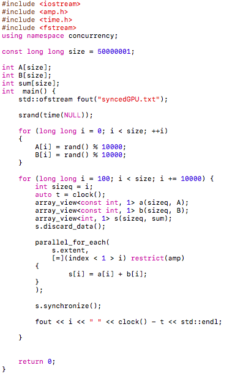

МИНИСТЕРСТВО ОБРАЗОВАНИЯ И НАУКИ РОССИЙСКОЙ ФЕДЕРАЦИИ

ФЕДЕРАЛЬНОЕ ГОСУДАРСТВЕННОЕ АВТОНОМНОЕ ОБРАЗОВАТЕЛЬНОЕ УЧРЕЖДЕНИЕ
ВЫСШЕГО ОБРАЗОВАНИЯ

«Санкт -- Петербургский национальный исследовательский университет
информационных технологий, механики и оптики»

Факультет информационных технологий и программирования

Кафедра информационных систем

Дополнительный проект

Сравнение скорости вычислений на CPU и GPU

> > Выполнили студенты группы №M3105:
>
> > Малинин Александр Сергеевич\
> > Баркалов Максим Максимович
>
> Проверила
>
> Артемова Галина Олеговна

САНКТ -- ПЕТЕРБУРГ

2017

В качестве примера операции за основу взято сложение чисел на массивах
большого размера. Данную операцию можно выполнять несколькими способами:

--- Линейно: идти от начала размера до конца, складывать по одному
элементу

--- Параллельно делать сложения для нескольких элементов сразу

Напишем программу с помощью Visual С++, которая будет делать это
линейно, для размеров массива от малого (100 элементов) до большого
(50000001 элементов) с шагом в 10000 элементов.

{width="5.822916666666667in"
height="6.063194444444444in"}

Время выполнения занесём в таблицу.

Напишем программу с использованием параллельных возможностей GPU.

{width="5.2659722222222225in"
height="8.544444444444444in"}

Результаты измерений времени занесены в таблицу.

Напишем программу, которая будет выполнять ту же задачу, но на одном
потоке GPU.

{width="6.49375in"
height="7.468055555555556in"}

Результаты также внесём в таблицу.

На основе таблицы измерений получаем график времени работы:

{width="6.49375in"
height="3.152083333333333in"}

Здесь синим цветом демонстрируется зависимость скорости вычисления на
GPU от размера массива, оранжевым --- CPU, серым --- GPU в
последовательном режиме (на одном потоке).

Вывод:

Графическое ядро выигрывает по скорости у процессора благодаря
параллельным вычислениям, при этом при линейной работе сильно
проигрывает из-за более низкой частоты.
