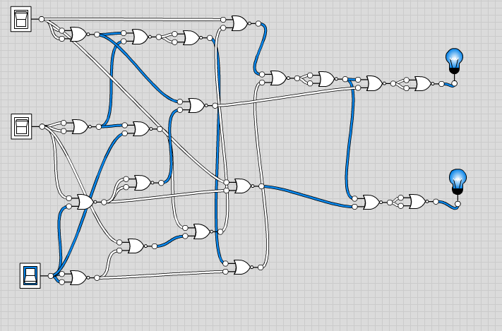
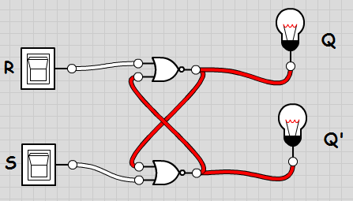

МИНИСТЕРСТВО ОБРАЗОВАНИЯ И НАУКИ РОССИЙСКОЙ ФЕДЕРАЦИИ\
ФЕДЕРАЛЬНОЕ ГОСУДАРСТВЕННОЕ АВТОНОМНОЕ ОБРАЗОВАТЕЛЬНОЕ УЧРЕЖДЕНИЕ
ВЫСШЕГО ОБРАЗОВАНИЯ

«Санкт-Петербургский национальный исследовательский университет

информационных технологий, механики и оптики»

Факультет информационных технологий и программирования

Кафедра информационных систем

Лабораторная работа № 1

Исследование комбинационных схем

> Выполнил студент группы № M3101:\
> Шипкова Мария Александровна
>
> Проверила:
>
> Артёмова Галина Олеговна

САНКТ--ПЕТЕРБУРГ

2017

Полный одноразрядный вычитатель

1.  В соответствии с заданием построить схему устройства:

    a.  описать функционирование устройства

> Полный одноразрядный вычитатель -- устройство для вычитания чисел в
> двоичной системе счисления. Имеет 3 входа (2 числа и заём) и 2 выхода
> (число и заём)

b.  построить таблицу истинности

  x   y   z   f   f \'
  --- --- --- --- ------
  0   0   0   0   0
  0   0   1   1   1
  0   1   0   1   1
  0   1   1   0   1
  1   0   0   1   0
  1   0   1   0   0
  1   1   0   0   0
  1   1   1   1   1

c.  в соответствии с таблицей истинности записать булевы выражения для
    выходов в базисе НЕ-И или НЕ-ИЛИ

$$f\left( x,y,z \right) = (\ \left( \ \left( \ \left( \ \left( \overline{x} \downarrow \overline{y} \right) \downarrow \left( \overline{x} \downarrow \overline{y} \right)\  \right) \downarrow \overline{z} \right)\  \downarrow \left( \ \left( \overline{y} \downarrow z \right)\  \downarrow \ \left( \overline{z} \downarrow y \right)\  \right)\  \right) \downarrow$$

$$\left( \ \left( \ \left( \ \left( \overline{x} \downarrow \overline{y} \right) \downarrow \left( \overline{x} \downarrow \overline{y} \right)\  \right) \downarrow \overline{z} \right)\  \downarrow \left( \ \left( \overline{y} \downarrow z \right)\  \downarrow \ \left( \overline{z} \downarrow y \right)\  \right)\  \right) \downarrow \left( \overline{x}\  \downarrow \left( \left( \ y \downarrow z \right) \downarrow \left( \ y \downarrow z \right) \right)\  \right)\ \ ) \downarrow$$

$$(\ \ \ \left( \ \left( \ \left( \ \left( \overline{x} \downarrow \overline{y} \right) \downarrow \left( \overline{x} \downarrow \overline{y} \right)\  \right) \downarrow \overline{z} \right)\  \downarrow \left( \ \left( \overline{y} \downarrow z \right)\  \downarrow \ \left( \overline{z} \downarrow y \right)\  \right)\  \right) \downarrow$$

$$\left( \ \left( \ \left( \ \left( \overline{x} \downarrow \overline{y} \right) \downarrow \left( \overline{x} \downarrow \overline{y} \right)\  \right) \downarrow \overline{z} \right)\  \downarrow \left( \ \left( \overline{y} \downarrow z \right)\  \downarrow \ \left( \overline{z} \downarrow y \right)\  \right)\  \right) \downarrow \left( \overline{x}\  \downarrow \left( \left( \ y \downarrow z \right) \downarrow \left( \ y \downarrow z \right) \right)\  \right)\ \ \ )$$

$$f\ '\left( x,y,z \right) = \ \ (\ \left( \ \left( \ \left( \ \left( \overline{x} \downarrow \overline{y} \right) \downarrow \left( \overline{x} \downarrow \overline{y} \right)\  \right) \downarrow \overline{z} \right)\  \downarrow \left( \ \left( \overline{y} \downarrow z \right)\  \downarrow \ \left( \overline{z} \downarrow y \right)\  \right)\  \right) \downarrow$$

$$\left( \ \left( \ \left( \ \left( \overline{x} \downarrow \overline{y} \right) \downarrow \left( \overline{x} \downarrow \overline{y} \right)\  \right) \downarrow \overline{z} \right)\  \downarrow \left( \ \left( \overline{y} \downarrow z \right)\  \downarrow \ \left( \overline{z} \downarrow y \right)\  \right)\  \right)\  \downarrow \left( \left( y \downarrow z \right) \downarrow x \right) \downarrow \ \ $$

$$(\ \left( \ \left( \ \left( \ \left( \overline{x} \downarrow \overline{y} \right) \downarrow \left( \overline{x} \downarrow \overline{y} \right)\  \right) \downarrow \overline{z} \right)\  \downarrow \left( \ \left( \overline{y} \downarrow z \right)\  \downarrow \ \left( \overline{z} \downarrow y \right)\  \right)\  \right) \downarrow$$

$$\left( \ \left( \ \left( \ \left( \overline{x} \downarrow \overline{y} \right) \downarrow \left( \overline{x} \downarrow \overline{y} \right)\  \right) \downarrow \overline{z} \right)\  \downarrow \left( \ \left( \overline{y} \downarrow z \right)\  \downarrow \ \left( \overline{z} \downarrow y \right)\  \right)\  \right)\  \downarrow \left( \left( y \downarrow z \right) \downarrow x \right)\ $$

d.  построить логическую схему в соответствии с полученными выражениями

> {width="5.666666666666667in"
> height="3.5520833333333335in"}

e.  проверить работу схемы

> {width="7.3375in"
> height="4.604861111111111in"}
>
> {width="7.058333333333334in"
> height="4.465277777777778in"}
>
> {width="7.2444444444444445in"
> height="4.569444444444445in"}
>
> {width="7.406944444444444in"
> height="4.884027777777778in"}

2.  Рассчитать характеристики полученной схемы:

    a.  сложность = 40

    b.  быстродействие = 8

RS-триггер

1.  В соответствии с заданием построить схему устройства:

    a.  описать функционирование устройства

> Асинхронный RS-триггер используется как запоминающая ячейка (элемент
> памяти с объемом в один бит) и как составная часть других триггеров.
>
> RS-триггер именуется так из-за названия его входов:
>
> R -- reset (сбросить);
>
> S-- set (установить).
>
> Имеет два выхода -- прямой Q и инверсный $\overline{Q}$.
>
> Вход S используется для установки на прямом выходе триггера 1(на
> инверсном -- 0), а вход R -- для установки на прямом выходе триггера 0
> (на инверсном 1)
>
> В работе RS-триггера есть недостаток: существует запрещенная
> комбинация. Нельзя одновременно подавать единичные сигналы на оба
> входа, нормальная работа триггера в этом случае невозможна.

b.  построить таблицу истинности

  R   S   Q(t)   Q(t+1)   пояснение
  --- --- ------ -------- ------------------------
  0   0   0      0        хранение информации
  0   1   1      1        
  1   0   0      1        установка 1
  1   1   1      1        
  0   0   0      0        установка 0
  0   1   1      0        
  1   0   0      \-       запрещённые комбинации
  1   1   0      \-       

c.  в соответствии с таблицей истинности записать булевы выражения для
    выходов в базисе НЕ-И или НЕ-ИЛИ

> Q(t+1) =
> $\left( \ \left( \ \left( \left( S \downarrow Q \right) \downarrow \left( S \downarrow Q \right) \right) \downarrow \overline{R}\  \right) \downarrow \left( \overline{S} \downarrow \overline{Q} \right)\  \right) \downarrow \ \left( \ \left( \ \left( \left( S \downarrow Q \right) \downarrow \left( S \downarrow Q \right) \right) \downarrow \overline{R}\  \right) \downarrow \left( \overline{S} \downarrow \overline{Q} \right)\  \right)\ $
>
> построить логическую схему в соответствии с полученными выражениями
>
> {width="4.651388888888889in"
> height="2.651388888888889in"}

2.  Рассчитать характеристики полученной схемы:

    a.  сложность = 4

    b.  быстродействие = 1

3.  Описать функционирование одной из полученных схем с помощью
    временной диаграммы

> {width="3.604861111111111in"
> height="2.41875in"}
>
> Использованные источники:
>
> <http://h4e.ru/nizkovoltnaya-apparatura/131-printsip-raboty-rs-triggera>
>
> https://ru.wikipedia.org/wiki/%D0%92%D1%8B%D1%87%D0%B8%D1%82%D0%B0%D1%82%D0%B5%D0%BB%D1%8C
