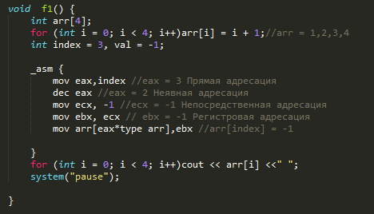
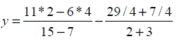
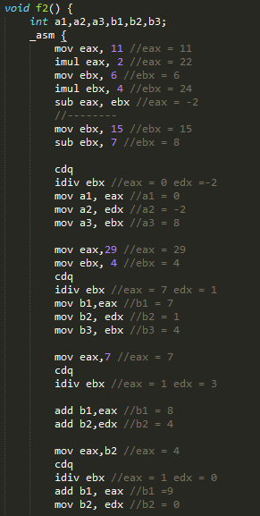
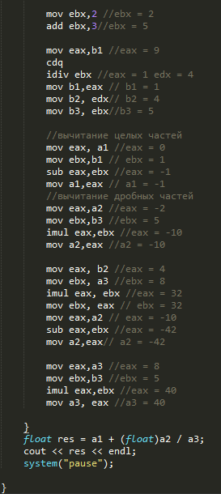
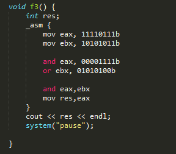
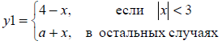
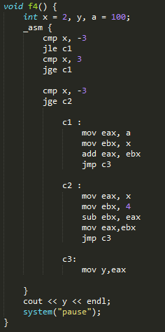
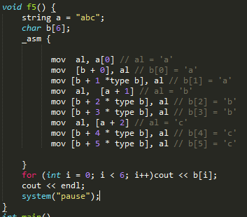

МИНИСТЕРСТВО ОБРАЗОВАНИЯ И НАУКИ РОССИЙСКОЙ ФЕДЕРАЦИИ\
ФЕДЕРАЛЬНОЕ ГОСУДАРСТВЕННОЕ АВТОНОМНОЕ ОБРАЗОВАТЕЛЬНОЕ УЧРЕЖДЕНИЕ
ВЫСШЕГО ОБРАЗОВАНИЯ

«Санкт-Петербургский национальный исследовательский университет

информационных технологий, механики и оптики»

Факультет информационных технологий и программирования

Кафедра информационных систем

Лабораторная работа № 2

> Изучение архитектуры команд и способов адресации
>
> Выполнил студент группы № M3101:\
> Шипкова Мария Александровна
>
> Проверила:
>
> Артёмова Галина Олеговна

САНКТ--ПЕТЕРБУРГ

2017

**Цель работы:** изучение системы команд и способов адресации во
встроенном ассемблере

**Задание на лабораторную работу:**

1.  *Изучить команды пересылки данных и арифметические команды*

    a.  Написать программу, выполняющую вычисления по заданному массиву
        с использованием всех возможных режимов адресации для доступа к
        элементам массива

    b.  в комментарии указать результат каждой операции (изменение
        состояния регистров)

> Изменить значение элемента массива по индексу
>
> {width="4.877083333333333in"
> height="2.792361111111111in"}

2.  *Изучить арифметические команды*

    a.  Написать программу, выполняющую вычисления по формуле

    b.  в комментарии указать результат каждой операции (изменение
        состояния регистров)

> {width="2.6131944444444444in"
> height="0.6131944444444445in"}
>
> {width="3.165213254593176in"
> height="6.288862642169729in"}{width="2.839583333333333in"
> height="6.358333333333333in"}

3.  *Изучить команды логических операций и сдвигов*

    a.  Написать программу, выполняющую вычисления

    b.  в комментарии указать результат каждой операции (изменение
        состояния регистров)

> Даны два числа в двоичном виде. В первом числе старшие (4 разряда)
> разряды обнулить. Во втором числе сделать единицами 2,4,6 разряды.
> Полученные результаты логически перемножить
>
> {width="2.6419575678040244in"
> height="2.328536745406824in"}

4.  *Изучить команды условных переходов*

    a.  Написать программу, выполняющую вычисления

    b.  в комментарии указать результат каждой операции (изменение
        состояния регистров)

> {width="2.8541666666666665in"
> height="0.6354166666666666in"}
>
> {width="2.4625in"
> height="4.924305555555556in"}

5.  *Изучить работу со строками*

    a.  Написать программу, которая по заданной строке выполняет
        вычисления (при желании можно использовать циклы)

    b.  в комментарии указать результат каждой операции (изменение
        состояния регистров)

Удвоить символы в строке

> {width="3.6743055555555557in"
> height="3.232638888888889in"}

Список использованной литературы

http://natalia.appmat.ru/c&c++/assembler.html

<http://stackoverflow.com>

http://www.codenet.ru/progr/asm/newbee/lesson3.php
